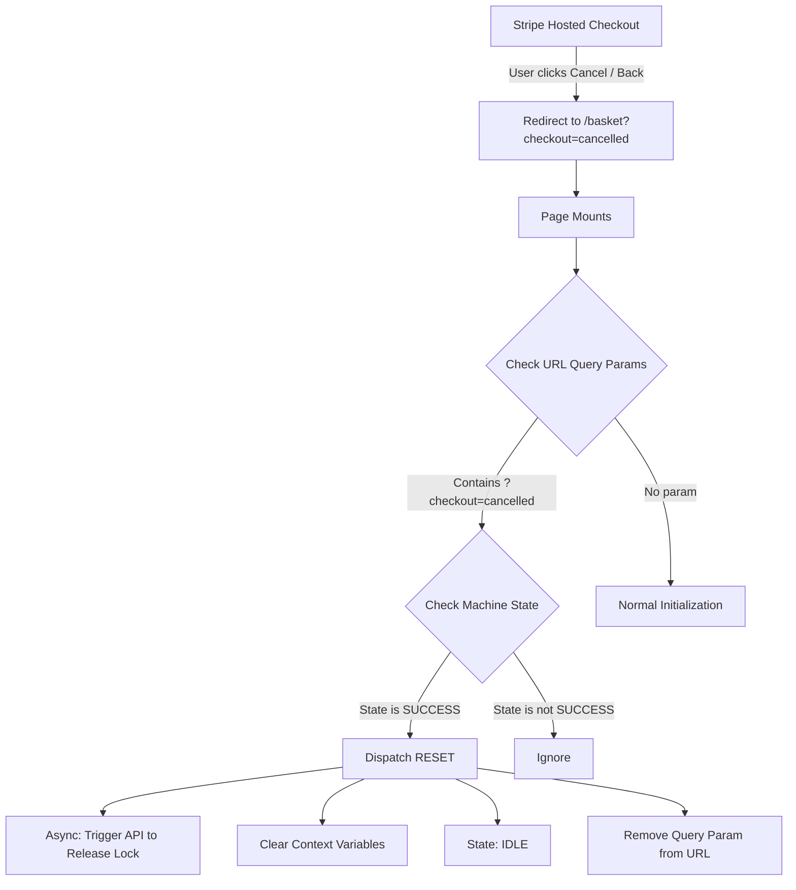

```mermaid
flowchart TD
    A[Stripe Hosted Checkout] -->|User clicks Cancel / Back| B[Redirect to /basket?checkout=cancelled]
    B --> C[Page Mounts]
    C --> D{Check URL Query Params}
    D -->|Contains ?checkout=cancelled| E{Check Machine State}
    D -->|No param| F[Normal Initialization]

    E -->|State is SUCCESS| G[Dispatch RESET]
    G --> H[Async: Trigger API to Release Lock]
    G --> I[Clear Context Variables]
    G --> J[State: IDLE]
    G --> L[Remove Query Param from URL]

    E -->|State is not SUCCESS| K[Ignore]
```