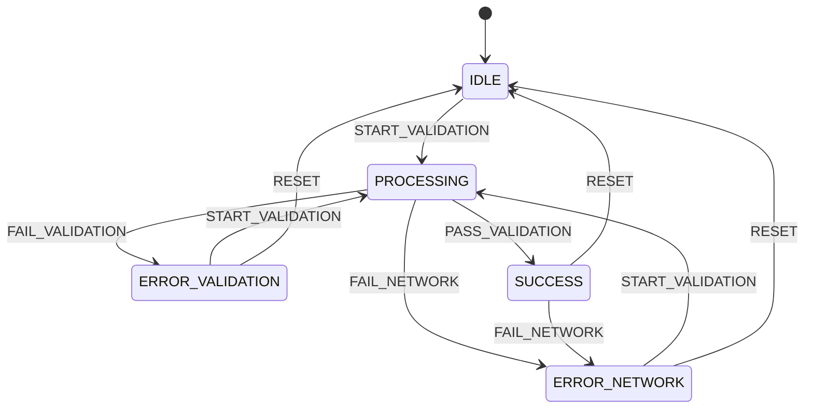

```mermaid
stateDiagram-v2
    direction TB

    [*] --> IDLE

    IDLE --> PROCESSING : START_VALIDATION

    PROCESSING --> ERROR_NETWORK : FAIL_NETWORK
    PROCESSING --> ERROR_VALIDATION : FAIL_VALIDATION
    PROCESSING --> SUCCESS : PASS_VALIDATION

    ERROR_NETWORK --> PROCESSING : START_VALIDATION
    ERROR_NETWORK --> IDLE : RESET

    ERROR_VALIDATION --> PROCESSING : START_VALIDATION
    ERROR_VALIDATION --> IDLE : RESET

    SUCCESS --> IDLE : RESET
    SUCCESS --> ERROR_NETWORK : FAIL_NETWORK
```