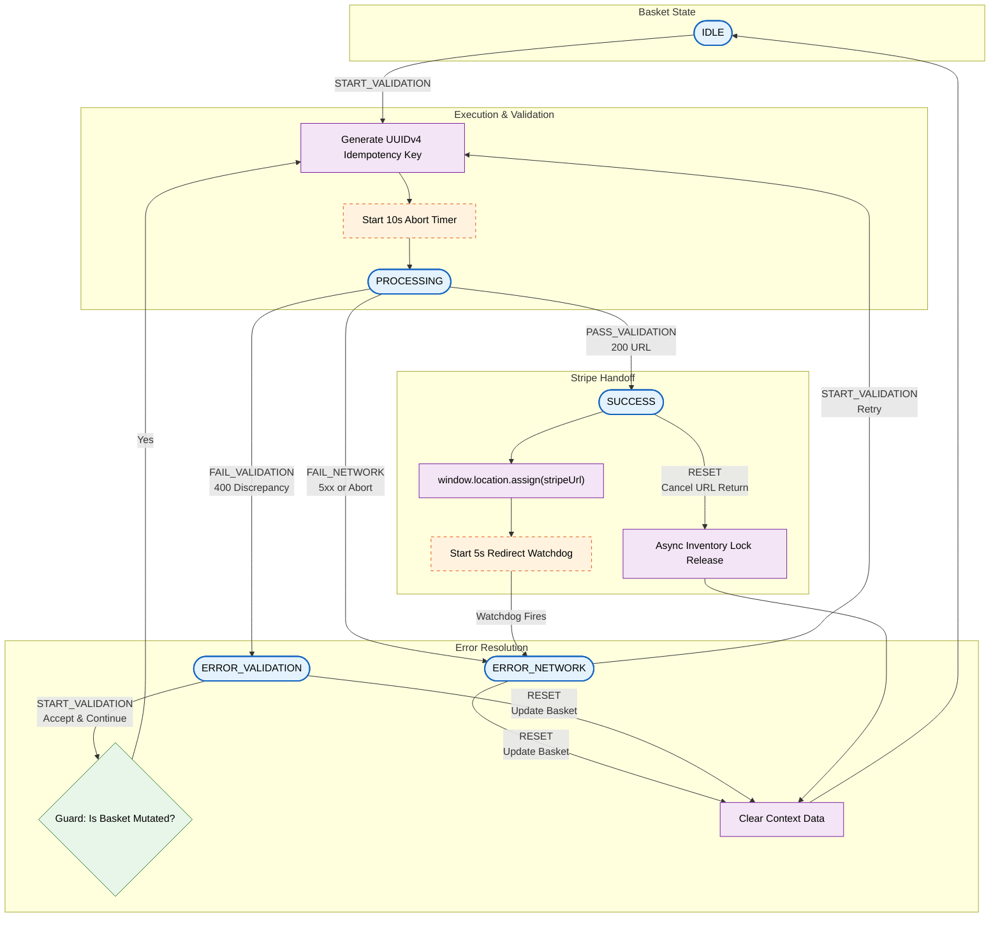

```mermaid
flowchart TD
    classDef state fill:#e3f2fd,stroke:#1565c0,stroke-width:2px,color:#000
    classDef action fill:#f3e5f5,stroke:#7b1fa2,stroke-width:1px,color:#000
    classDef guard fill:#e8f5e9,stroke:#2e7d32,stroke-width:1px,color:#000
    classDef timer fill:#fff3e0,stroke:#e65100,stroke-width:1px,stroke-dasharray: 5 5,color:#000

    subgraph Basket ["Basket State"]
        IDLE(["IDLE"]):::state
    end

    subgraph Execution ["Execution & Validation"]
        GEN_KEY["Generate UUIDv4 Idempotency Key"]:::action
        TIMER_10["Start 10s Abort Timer"]:::timer
        PROCESSING(["PROCESSING"]):::state

        GEN_KEY --> TIMER_10
        TIMER_10 --> PROCESSING
    end

    subgraph Resolution ["Error Resolution"]
        ERR_NET(["ERROR_NETWORK"]):::state
        ERR_VAL(["ERROR_VALIDATION"]):::state
        GUARD_MUT{"Guard: Is Basket Mutated?"}:::guard
        CLEAR_CTX["Clear Context Data"]:::action
    end

    subgraph Handoff ["Stripe Handoff"]
        SUCCESS(["SUCCESS"]):::state
        REDIRECT["window.location.assign(stripeUrl)"]:::action
        TIMER_5["Start 5s Redirect Watchdog"]:::timer
        RELEASE["Async Inventory Lock Release"]:::action
    end

    IDLE -->|START_VALIDATION| GEN_KEY

    PROCESSING -->|FAIL_NETWORK\n5xx or Abort| ERR_NET
    PROCESSING -->|FAIL_VALIDATION\n400 Discrepancy| ERR_VAL
    PROCESSING -->|PASS_VALIDATION\n200 URL| SUCCESS

    SUCCESS --> REDIRECT
    REDIRECT --> TIMER_5

    TIMER_5 -->|Watchdog Fires| ERR_NET

    ERR_NET -->|START_VALIDATION\nRetry| GEN_KEY

    ERR_VAL -->|START_VALIDATION\nAccept & Continue| GUARD_MUT
    GUARD_MUT -->|Yes| GEN_KEY

    ERR_NET -->|RESET\nUpdate Basket| CLEAR_CTX
    ERR_VAL -->|RESET\nUpdate Basket| CLEAR_CTX

    SUCCESS -->|RESET\nCancel URL Return| RELEASE
    RELEASE --> CLEAR_CTX

    CLEAR_CTX --> IDLE
```