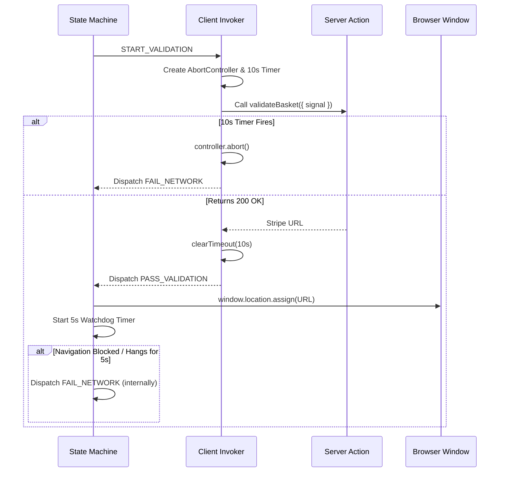

```mermaid
sequenceDiagram
    participant SM as State Machine
    participant Action as Client Invoker
    participant Server as Server Action
    participant Window as Browser Window

    SM->>Action: START_VALIDATION
    Action->>Action: Create AbortController & 10s Timer
    Action->>Server: Call validateBasket({ signal })

    alt 10s Timer Fires
        Action->>Action: controller.abort()
        Action-->>SM: Dispatch FAIL_NETWORK
    else Returns 200 OK
        Server-->>Action: Stripe URL
        Action->>Action: clearTimeout(10s)
        Action-->>SM: Dispatch PASS_VALIDATION
        SM->>Window: window.location.assign(URL)
        SM->>SM: Start 5s Watchdog Timer
        alt Navigation Blocked / Hangs for 5s
            SM->>SM: Dispatch FAIL_NETWORK (internally)
        end
    end
```