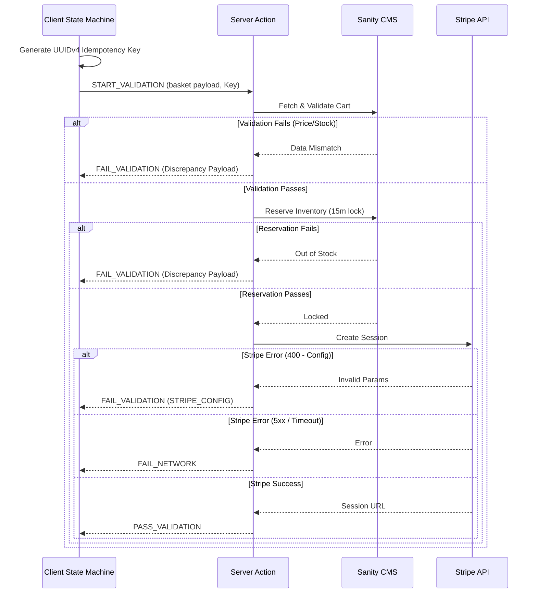

```mermaid
sequenceDiagram
    participant UI as Client State Machine
    participant API as Server Action
    participant CMS as Sanity CMS
    participant Stripe as Stripe API

    UI->>UI: Generate UUIDv4 Idempotency Key
    UI->>API: START_VALIDATION (basket payload, Key)
    API->>CMS: Fetch & Validate Cart

    alt Validation Fails (Price/Stock)
        CMS-->>API: Data Mismatch
        API-->>UI: FAIL_VALIDATION (Discrepancy Payload)
    else Validation Passes
        API->>CMS: Reserve Inventory (15m lock)
        alt Reservation Fails
            CMS-->>API: Out of Stock
            API-->>UI: FAIL_VALIDATION (Discrepancy Payload)
        else Reservation Passes
            CMS-->>API: Locked
            API->>Stripe: Create Session
            alt Stripe Error (400 - Config)
                Stripe-->>API: Invalid Params
                API-->>UI: FAIL_VALIDATION (STRIPE_CONFIG)
            else Stripe Error (5xx / Timeout)
                Stripe-->>API: Error
                API-->>UI: FAIL_NETWORK
            else Stripe Success
                Stripe-->>API: Session URL
                API-->>UI: PASS_VALIDATION
            end
        end
    end
```