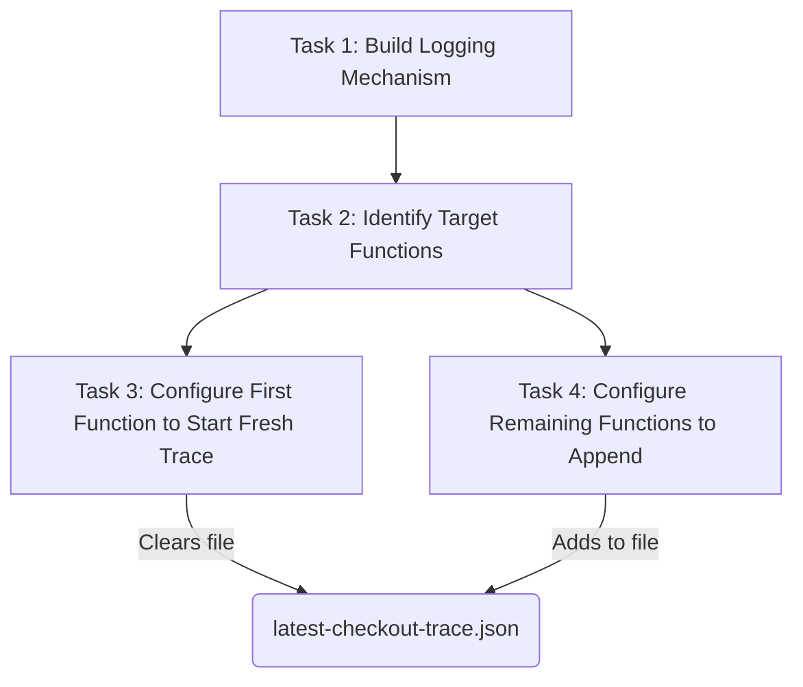

# Task Decomposition & Graph

## Task Breakdown

**Task 1:** Build a mechanism that captures function execution data (inputs, outputs, errors) and persists it to a file.

**Task 2:** Identify the sequence of functions that need to be logged in the checkout flow.

**Task 3:** Configure the first function in the sequence to start a fresh trace (clear previous data).

**Task 4:** Configure the remaining functions in the sequence to append to the existing trace.

## Tasks Graph

