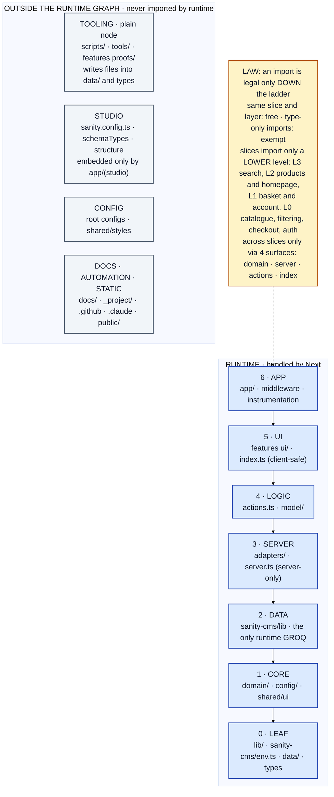

# Organizational pattern: single source of truth

Normative model of how this repository is organized. It says what the repo **should be**. It is a separate concern from what the repo currently is. Where the code disagrees with this document, the code is defective. A rule changes only by editing this file.

Derived and checked 2026-10-03 against `origin/main` at `ef60f05c`.

## 1. Five axioms

Everything else in this document is derived from these.

| # | Axiom | Why it cannot be dropped |
|---|-------|--------------------------|
| A1 | **Placement follows the consumer.** A file lives where the process that loads it lives. Every tracked path has exactly one zone, decided by its path prefix. | Without it a file has two plausible homes (a probe script: feature or scripts?). |
| A2 | **Two worlds, never mixed.** The *runtime graph* is code bundled by Next. Everything else (tooling, studio, config, docs, automation) is a *plane* outside it. Runtime never imports a plane. Planes exchange data with runtime only through files. | Without it build-time code and request-time code entangle (a build script needing app code, or the reverse). |
| A3 | **Rank.** Runtime layers have integer ranks 0 to 6. A value import is legal iff `rank(importer) > rank(imported)`. Inside one layer of one slice (or one zone), imports are free. `import type` is erased at compile time and is exempt from rank. | Without it layers can depend on each other in both directions. |
| A4 | **Level.** Features are vertical slices with integer levels 0 to 3. A cross-slice import is legal iff `level(importer) > level(imported)`. | Without it features can depend on each other in cycles. |
| A5 | **Surface.** A feature publishes exactly four surfaces, ordered by rank: `domain` (1) < `server` (3) < `actions` (4) < `index` (5). Imports of a feature from outside that feature target only these. Everything else in a feature is private. | Without it other code couples to a feature's internals. |

One environment rule completes them (A6): **client-safe code never imports server-only code.** `ui/`, `model/`, `domain/`, `config/`, `shared/ui` and `index.ts` are client-safe. Every server-only file starts with `import 'server-only'`, and the build enforces the rest.

## 2. The ladder (runtime graph)

Imports go **down** only. This table is the whole dependency law.

| Rank | Layer | Where | Role | May import |
|------|-------|-------|------|------------|
| 6 | APP | `app/`, `middleware.ts`, `instrumentation*.ts`, `sentry.*.config.ts` | routes, framework entry files, composition root; server-rendered components live here beside their route | 0 to 5 |
| 5 | UI | `features/<f>/ui/`, `features/<f>/index.ts` | client-safe components, client face | 0 to 4 |
| 4 | LOGIC | `features/<f>/actions.ts`, `features/<f>/model/` | mutations (Server Actions), client state and hooks | 0 to 3 |
| 3 | SERVER | `features/<f>/adapters/`, `features/<f>/server.ts` | server-only I/O to external services and the session; server face | 0 to 2 |
| 2 | DATA | `sanity-cms/lib/` | the only runtime code that speaks GROQ or patches | 0 to 1 |
| 1 | CORE | `features/<f>/domain/`, `features/<f>/config/`, `shared/ui/` | pure types, logic, constants, presentational primitives | 0 |
| 0 | LEAF | `lib/`, `sanity-cms/env.ts`, `data/`, `sanity.types.ts` | utilities, SDK clients, generated data; imports nothing from the repo | npm only |

Feature levels (A4): L3 `product-search`; L2 `products`, `homepage`; L1 `basket`, `account`; L0 `catalogue`, `product-filtering`, `checkout`, `auth`.

Consequences derived from the axioms, replacing the rules that used to be written separately:

| Old rule | Derivation |
|----------|------------|
| Features never import `app/` | `app` is rank 6, the highest |
| `shared/` imports neither `app/` nor `features/` | `shared/ui` is rank 1 and may import only rank 0 |
| Features reach Sanity only through `actions.ts` or `adapters/` | `ui/` and `model/` are client-safe (A6) and cannot import the server-only DATA layer; `domain/` and `config/` rank below it |
| The data layer never imports `actions.ts` | DATA is rank 2, `actions` is rank 4 |
| Deep imports into another feature are forbidden | A5. Imports inside the same feature are free (A3), so `@/features/basket/model/x` from inside `basket` is correct |
| Feature order L0 to L3 | A4 as an inequality instead of an edge list |
| Adapters are imported only by `server.ts` and `actions.ts` | adapters are server-only (A6), so `ui/` cannot import them; they are private (A5) |

## 3. Planes (outside the runtime graph)

| Plane | Where | Loaded by | Rule |
|-------|-------|-----------|------|
| Studio | `sanity.config.ts`, `sanity-cms/schemaTypes/`, `sanity-cms/structure.ts` | Sanity Studio, Sanity CLI | imports only itself and `sanity-cms/env.ts`; the only runtime importer is `app/(studio)` |
| Tooling | `scripts/`, `tools/`, `features/<f>/proofs/` | plain node, never bundled | may hold its own queries and clients; imports nothing from runtime; nothing in runtime imports it; writes results as files into `data/` or generated types |
| Config | root tool configs (`package.json`, `tsconfig.json`, `next.config.ts`, `tailwind.config.ts`, `postcss.config.mjs`, `eslint.config.mjs`, `.prettierrc`, `.node-version`, `.gitignore`, `.env.example`, `sanity.cli.ts`), `shared/styles/` | build and dev tools | may import Config and Tooling only |
| Docs | `docs/`, `_project/`, `README.md`, `CLAUDE.md`, `AGENTS.md` | humans and agents | imports nothing |
| Automation | `.github/`, `.claude/`, `.codex/`, `.devin/`, `vercel.json`, `.no-mistakes.yaml`, `skills-lock.json` | external services and agents | imports nothing |
| Static and generated | `public/`, `schema.json` | the web server, Sanity typegen | imports nothing |

A root file is allowed iff a tool requires it at the root. That puts it in Config, Automation, Docs, Static and generated, LEAF (`sanity.types.ts`) or APP (framework entry files); the allowlist is therefore a consequence of the zones, not a separate list.

## 4. Where each kind of thing lives

27 kinds, one home each. A kind that has no row here means the model is incomplete.

| Kind | Home |
|------|------|
| Route, page, layout, route handler | `app/` |
| Framework entry file (middleware, instrumentation, Sentry) | repo root (tool-mandated) |
| Server-rendered component bound to one route | `app/`, beside the route |
| Feature component | `features/<f>/ui/` |
| Feature client state or hook | `features/<f>/model/` |
| Feature mutation (Server Action) | `features/<f>/actions.ts` |
| Feature external-service wrapper, session reader | `features/<f>/adapters/`, published by `features/<f>/server.ts` |
| Feature pure logic or types | `features/<f>/domain/` (published by a `domain/index.ts` barrel when a lower rank needs its values) |
| Feature constants | `features/<f>/config/` |
| Cross-slice client face | `features/<f>/index.ts` |
| Shared presentational primitive | `shared/ui/` |
| Design tokens, Tailwind plugin | `shared/styles/` |
| GROQ query, Sanity patch (runtime) | `sanity-cms/lib/<domain>/` |
| Sanity read and write clients | `sanity-cms/lib/client.ts`, `sanity-cms/lib/backendClient.ts` |
| Cross-cutting utility or SDK client with no repo dependency | `lib/` |
| Server service that needs the data layer (for example the auth instance and session reader) | `features/<f>/adapters/`, published by `features/<f>/server.ts` |
| Studio schema and structure | `sanity-cms/schemaTypes/`, `sanity-cms/structure.ts`, `sanity.config.ts` |
| Env config shared by Studio and runtime | `sanity-cms/env.ts` |
| Build-time script | `scripts/` |
| Local tooling (lint plugin, import check) | `tools/` |
| Per-feature live probe | `features/<f>/proofs/` |
| Generated data consumed by runtime | `data/` |
| Generated types and schema | repo root, at the tool's default path (`sanity.types.ts`, `schema.json`) |
| Static asset | `public/` |
| Docs, process, entry docs | `docs/`, `_project/`, repo root |
| Agent and CI configuration | `.github/`, `.claude/`, `.codex/`, `.devin/` |
| Ephemeral (logs, caches, env files, phase files) | nowhere in git |

## 5. What changed relative to the previously documented pattern

Seven edits, everything else unchanged.

1. One dependency law (the ladder) replaces the separate NO_APP, NO_FEATURES, NO_SANITY and data-layer rules.
2. The entry rule applies **across slices** only; imports within a slice are free by rank.
3. `server.ts` becomes the server face (rank 3) and may import the data layer, as adapters do. Pure values that lower ranks need are published by `domain`.
4. Planes are explicit, so build scripts and probes holding queries are accounted for, not exceptions.
5. `lib/` is a leaf. A server service that needs the data layer belongs to a feature.
6. `ui/` is client-safe by definition; server-rendered components live in `app/` beside their route.
7. Feature order is an inequality on levels instead of an explicit edge list.

Unchanged: feature shape and the entry file names, the data layer's name and location, the root layout, naming, hygiene.

## 6. Conventions (not structural)

These do not follow from the axioms and are enforced by review.

- Specifier form: `./x` for the same directory, `@/...` for everything else, no `..` anywhere in `features/`.
- Naming: components PascalCase; client/server pairs `XClient.tsx` and `XServer.tsx`; docs and scripts lowercase kebab-case; `lib/` module files camelCase; feature names are domain nouns.
- A Server Action is thin: auth guard, one call into the data layer, revalidate.
- Promotion: a component moves to `shared/ui/` when a second slice needs it; otherwise it stays in its feature.
- Hygiene: secrets, env files, logs, caches, working notes are never committed.
- Tests are retired; do not add test files, configs or dependencies without the owner's approval.

## 7. Proof

The model is proven by five short arguments, each checkable by a few lines of script.

| Claim | Argument | Enforced by |
|-------|----------|-------------|
| P1 Placement is total and unique | zones are disjoint path prefixes; features and `shared/` split on the second path segment | `tools/check-org-pattern.mjs`, rule PLACE |
| P2 No cycle between layers | along any inter-layer import rank strictly decreases; a cycle would need `r > r` | `tools/check-org-pattern.mjs`, rules RANK and ENV |
| P3 No cycle between features | along any cross-slice import level strictly decreases | `tools/check-org-pattern.mjs`, rules SURFACE and LEVEL |
| P4 Planes are isolated | the plane table has "imports nothing" or a short allowed list for each plane | `tools/check-org-pattern.mjs`, rule PLANE |
| P5 Nothing is left over | the kinds table covers every path | `tools/check-imports.mjs`, rules SPEC and DELETED |

Re-check procedure (any script): (1) map each tracked path to a zone by prefix; (2) extract import specifiers; (3) resolve `@/` and relative ones; (4) for each runtime edge test `rank(src) > rank(dst)` or same layer and slice; (5) for each cross-slice edge test the level inequality and that the target is a surface.

## Appendix A: the model on one screen

Designed for a 1920 x 1280 screen: 12 nodes, two columns, two-line labels, 22px font. It has not been rendered here.

