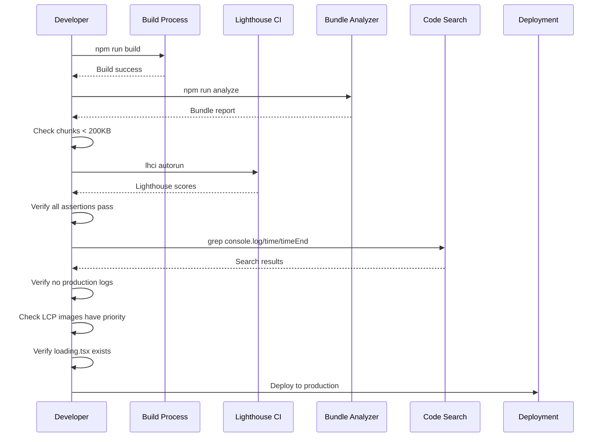
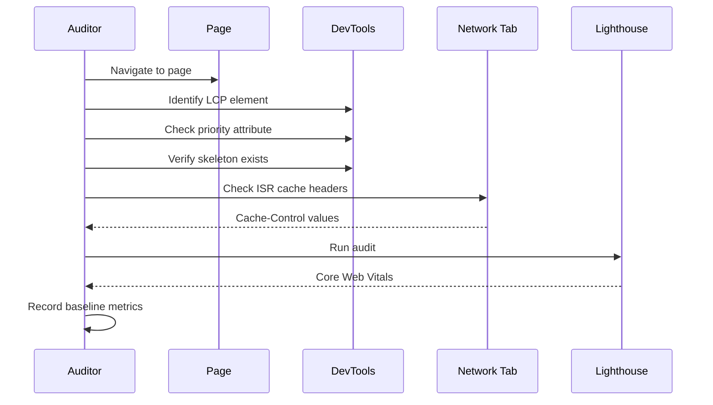

# Performance Audit Checklist Flow

## Pre-Deployment Audit Process

```mermaid
sequenceDiagram
    participant Dev as Developer
    participant Build as Build Process
    participant LHCI as Lighthouse CI
    participant Bundle as Bundle Analyzer
    participant Grep as Code Search
    participant Deploy as Deployment

    Dev->>Build: npm run build
    Build-->>Dev: Build success
    Dev->>Bundle: npm run analyze
    Bundle-->>Dev: Bundle report
    Dev->>Dev: Check chunks < 200KB
    Dev->>LHCI: lhci autorun
    LHCI-->>Dev: Lighthouse scores
    Dev->>Dev: Verify all assertions pass
    Dev->>Grep: grep console.log/time/timeEnd
    Grep-->>Dev: Search results
    Dev->>Dev: Verify no production logs
    Dev->>Dev: Check LCP images have priority
    Dev->>Dev: Verify loading.tsx exists
    Dev->>Deploy: Deploy to production
```

## Per-Page Verification

```mermaid
sequenceDiagram
    participant Auditor as Auditor
    participant Page as Page
    participant DevTools as DevTools
    participant Network as Network Tab
    participant Lighthouse as Lighthouse

    Auditor->>Page: Navigate to page
    Auditor->>DevTools: Identify LCP element
    Auditor->>DevTools: Check priority attribute
    Auditor->>DevTools: Verify skeleton exists
    Auditor->>Network: Check ISR cache headers
    Network-->>Auditor: Cache-Control values
    Auditor->>Lighthouse: Run audit
    Lighthouse-->>Auditor: Core Web Vitals
    Auditor->>Auditor: Record baseline metrics
```
