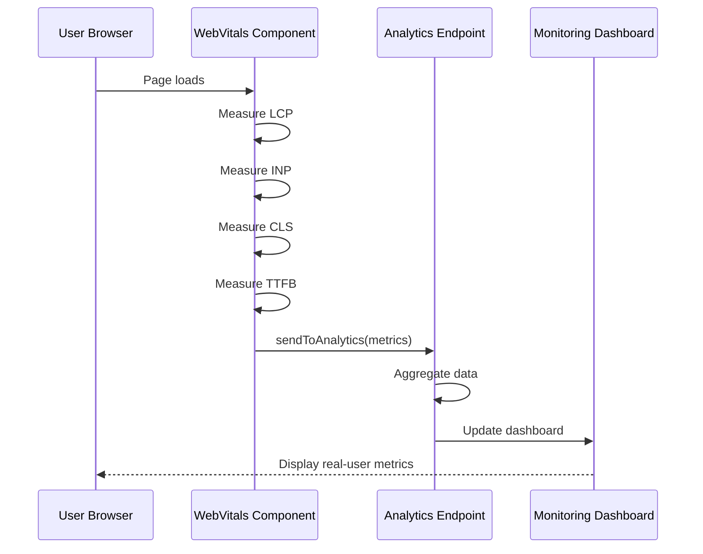
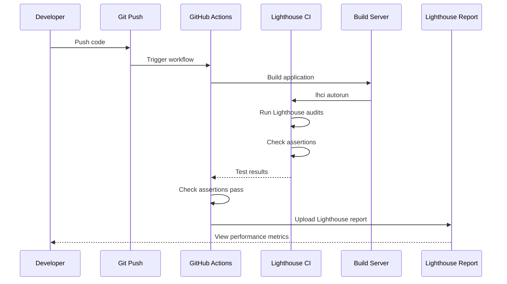

# Performance Monitoring Setup

## WebVitals Real User Monitoring

```mermaid
sequenceDiagram
    participant User as User Browser
    participant WebVitals as WebVitals Component
    participant Analytics as Analytics Endpoint
    participant Dashboard as Monitoring Dashboard

    User->>WebVitals: Page loads
    WebVitals->>WebVitals: Measure LCP
    WebVitals->>WebVitals: Measure INP
    WebVitals->>WebVitals: Measure CLS
    WebVitals->>WebVitals: Measure TTFB
    WebVitals->>Analytics: sendToAnalytics(metrics)
    Analytics->>Analytics: Aggregate data
    Analytics->>Dashboard: Update dashboard
    Dashboard-->>User: Display real-user metrics
```

## Lighthouse CI Integration

```mermaid
sequenceDiagram
    participant Dev as Developer
    participant Git as Git Push
    participant GH as GitHub Actions
    participant LHCI as Lighthouse CI
    participant Build as Build Server
    participant Report as Lighthouse Report

    Dev->>Git: Push code
    Git->>GH: Trigger workflow
    GH->>Build: Build application
    Build->>LHCI: lhci autorun
    LHCI->>LHCI: Run Lighthouse audits
    LHCI->>LHCI: Check assertions
    LHCI-->>GH: Test results
    GH->>GH: Check assertions pass
    GH->>Report: Upload Lighthouse report
    Report-->>Dev: View performance metrics
```
