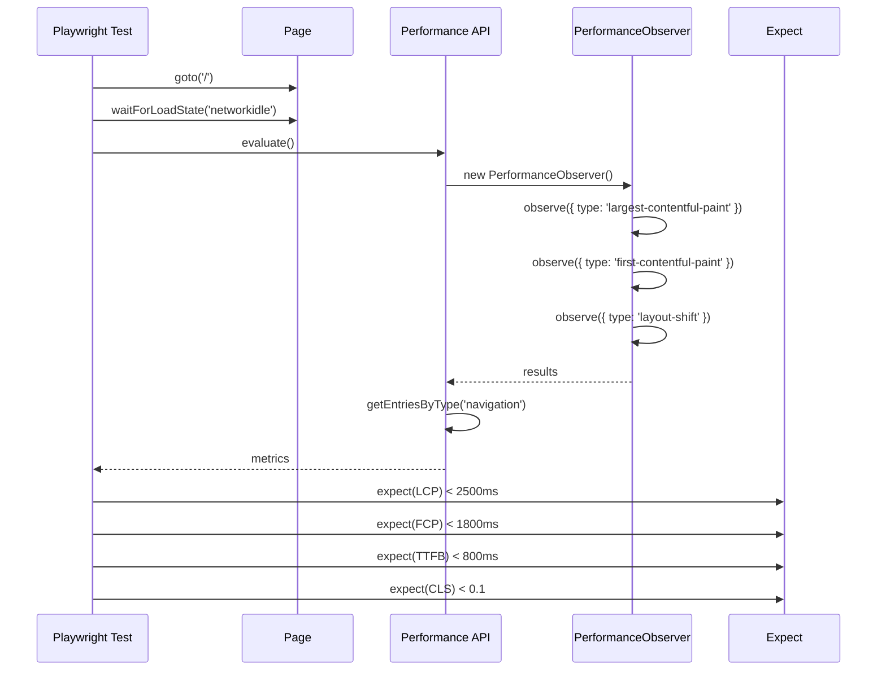

# Performance Test Flow

## Core Web Vitals Measurement

```mermaid
sequenceDiagram
    participant Test as Playwright Test
    participant Page as Page
    participant Metrics as Performance API
    participant Observer as PerformanceObserver
    participant Assert as Expect

    Test->>Page: goto('/')
    Test->>Page: waitForLoadState('networkidle')
    Test->>Metrics: evaluate()
    Metrics->>Observer: new PerformanceObserver()
    Observer->>Observer: observe({ type: 'largest-contentful-paint' })
    Observer->>Observer: observe({ type: 'first-contentful-paint' })
    Observer->>Observer: observe({ type: 'layout-shift' })
    Observer-->>Metrics: results
    Metrics->>Metrics: getEntriesByType('navigation')
    Metrics-->>Test: metrics
    Test->>Assert: expect(LCP) < 2500ms
    Test->>Assert: expect(FCP) < 1800ms
    Test->>Assert: expect(TTFB) < 800ms
    Test->>Assert: expect(CLS) < 0.1
```
