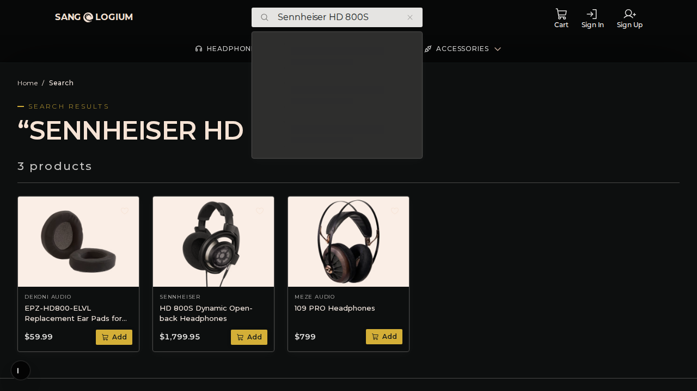
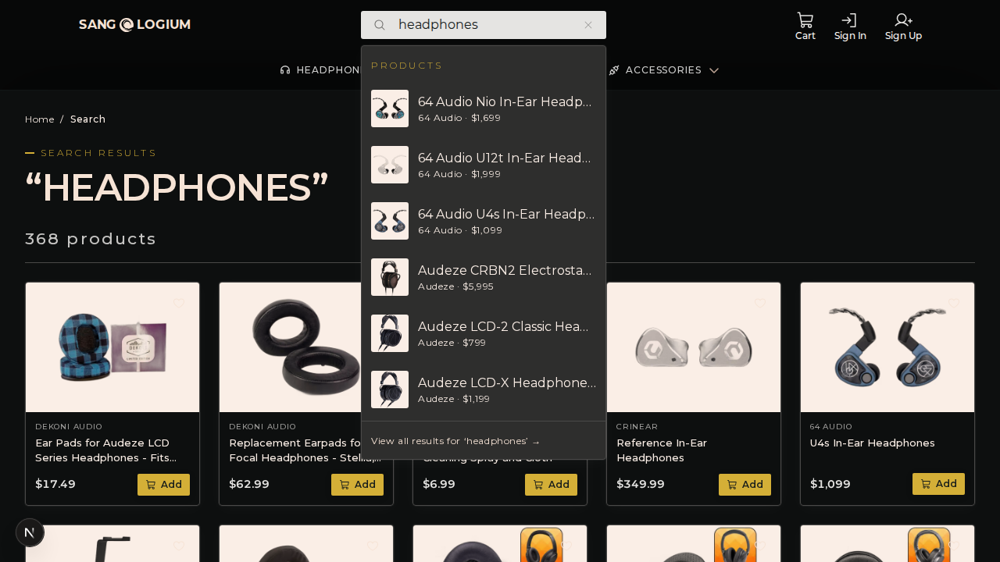
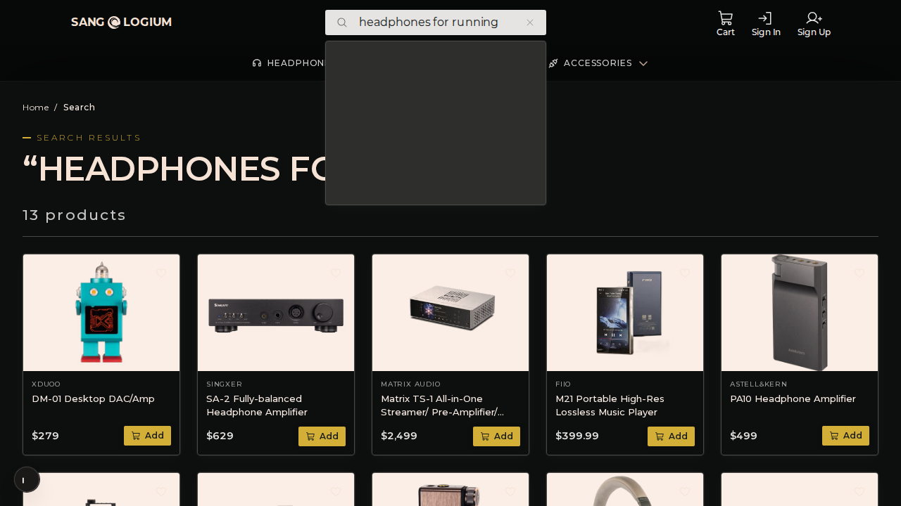
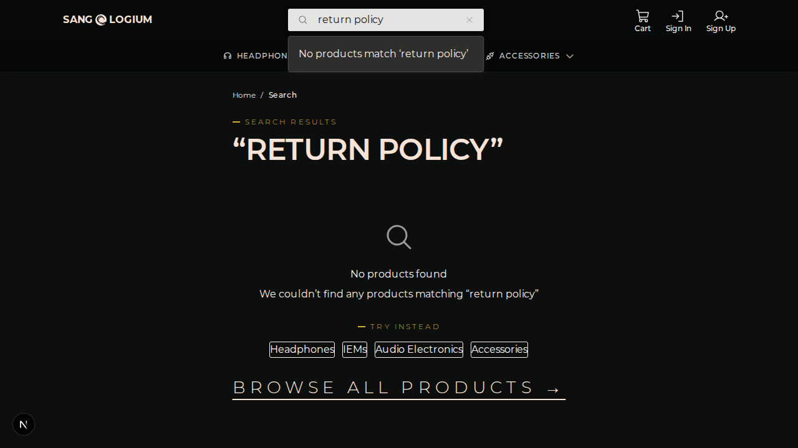
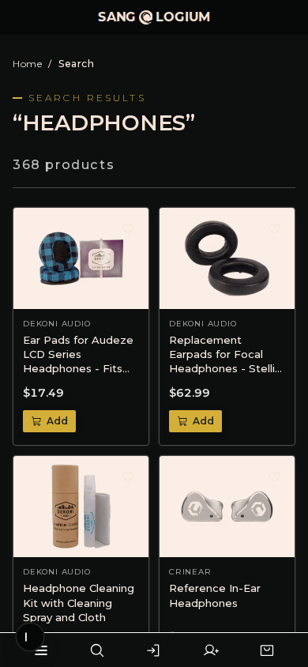
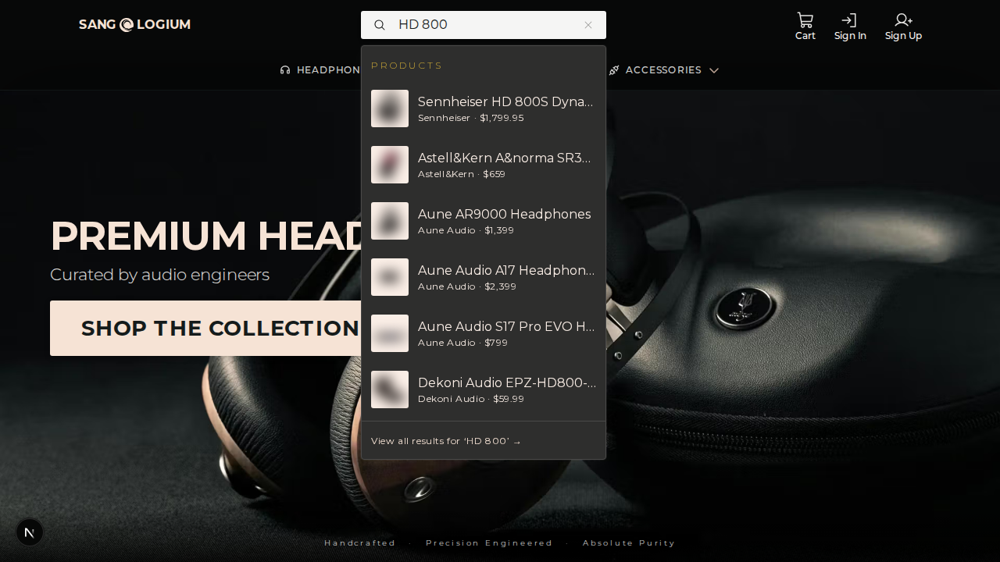
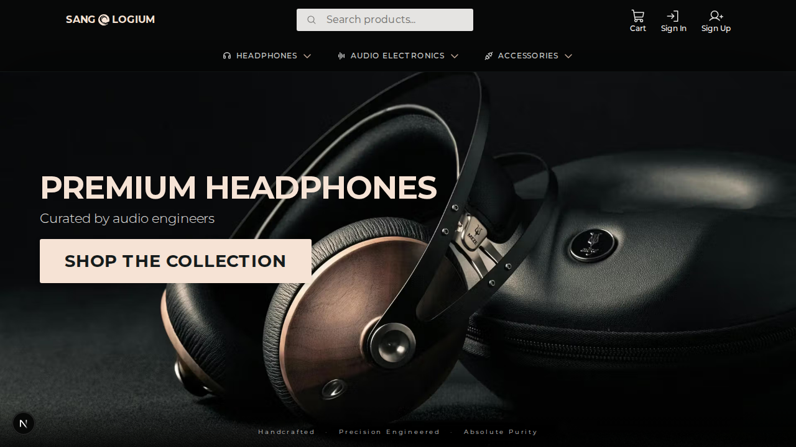

# Search UX — sanglogium implementation audit

Tracked by `sang-logium-d5m.7` — [Search] Audit redo: end-user UX, visual + SRP-correct filters  
Part of `sang-logium-d5m` — EPIC Search UX

This is the d5m.7 redo of the closed `sang-logium-d5m.2` audit. It preserves the functional findings from d5m.2 and adds two missing dimensions: (1) end-user visual/perceptual assessment of each result page, and (2) a scope-correct framing of filters/facets as an integration point with `sang-logium-3rv` (EPIC Filter Sort Migration), not a search-implementation failure.

## Method

- Live app at `http://localhost:3000` (dev server running on :3000).
- One batched Playwright session across desktop (1280×720) and mobile (390×844).
- Each query was entered as a real `?q=` URL and the result page was captured as text, DOM and a full-page screenshot.
- Functional evidence (d5m.2): `docs/search-ux/evidence/sanglogium-audit-1789452215147.json`
- Visual evidence (d5m.7): `docs/search-ux/evidence/sanglogium-audit-d5m7-visual.json` and `docs/search-ux/evidence/screenshots/sanglogium/`
- Visual standards: `docs/search-ux/intelligence-visual.md` (Baymard/NN/g visual criteria from d5m.6)
- Intelligence standards: `docs/search-ux/intelligence.md` (Baymard 8 query types + NN/g 6 findings)

The ratings below distinguish **functional** (does the query return the right things?) from **visual/perceptual** (does the result page look curated, legible and professional, and does the user understand what they are seeing?). Evidence must be in `docs/search-ux/evidence/`; the earlier `/tmp` path is no longer used.

## Scope note: filters are a `sang-logium-3rv` integration point

`app/(store)/products/page.tsx` already imports `FilterSidebar`, `SortBar`, `ActiveFilterChips` and the shared `buildProductQuery`/`sanitizeFilterState` helpers. `app/(store)/search/page.tsx` does not. This is not a search-engine defect; it is a missing integration with the shared filter/sort mechanism being built in `sang-logium-3rv`. The 3rv epic has one closed child (`3rv.1`) and three open children (`3rv.2`, `3rv.3`, `3rv.4`) for product-category facet parity.

Therefore the absence of filters on `/search` is rated as **Deferred / integration point**, not as a `Fail` against search UX. Once 3rv lands, the search route can reuse the same components and URL-state helpers. The visual/perceptual findings in this audit treat the missing filter panel as a presentational gap that will be closed by that integration, not as something the search implementation should fix in isolation.

## Functional snapshot — query type vs. standard

This section is the d5m.2 evidence, re-checked against the live app and retained unchanged because the functional behaviour has not changed.

| Query type | Test query | Result count | First result | Functional rating | vs. Baymard/NN/g |
|---|---|---:|---|---|---|
| Exact | `Sennheiser HD 800S` | 3 | EPZ-HD800-ELVL Replacement Ear Pads for Sennheiser HD800 and HD800S Elite Velour | Partial | Exact product should be #1; accessories should not outrank the product itself. |
| Exact/typo | `hd800s` | 4 | EPZ-HD800-ELVL Replacement Ear Pads for Sennheiser HD800 and HD800S Elite Velour | Fail | Baymard: must handle phonetic misspellings, alternate names and concatenated model numbers. The actual HD 800S is not returned. |
| Product type | `headphones` | 368 | Ear Pads for Audeze LCD Series Headphones | Partial | Baymard: auto-redirect to category on 1:1 match, return filter/sort on results. No redirect, no filter, accessories dominate. |
| Feature | `closed-back headphones` | 27 | Celestee Headphones | Partial | Baymard: searched attributes should auto-apply as filters. No filter auto-applied; mixed open-back and earpads in list. |
| Use case | `headphones for running` | 13 | DM-01 Desktop DAC/Amp | Fail | Baymard: use-case queries should tag products by occasion/activity. Returns DACs and amps, not running headphones. |
| Abbreviation/symbol | `IEM` | 111 | Reference In-Ear Headphones | Pass | Baymard: must map abbreviations to full terms. Correctly returns in-ear products. |
| Compatibility | `headphones for iPhone 15` | 2 | iFi GO bar Kensei | Fail | Baymard: must show compatibility details/suggest accessories. Returns two DACs, no headphone, no compatibility filter. |
| Symptom | `headphones with more bass` | 40 | Replacement Earpads for Focal Headphones | Partial | Baymard: symptom queries should return relevant product types and link buying guides. Keyword-only, no guide. |
| Non-product | `return policy` | 0 | — | Fail | Baymard: search should surface policies/FAQs. Returns empty product search with category links. |

Counts and product order were identical across mobile and desktop viewports in the captured session.

## Visual/perceptual snapshot — query type vs. sanglogium-d5m.6 standards

The d5m.6 standards are: (1) search field prominence, (2) autocomplete richness, (3) product-card hierarchy/consistency, (4) price scannability, (5) trust-signal density, (6) filters as visible controls, (7) empty-state helpfulness, (8) mobile hierarchy preservation.

| Query type | Test query | Visual rating | What the end user sees and understands |
|---|---|---|---|
| Exact | `Sennheiser HD 800S` | Partial | Only 3 products. Product cards are clean and consistent (image → brand → name → price → Add), but the first card is an ear-pad accessory and the second is the real headphone, with no visual distinction. A dark autocomplete overlay appears over the results on desktop. |
| Exact/typo | `hd800s` | Partial | 4 products; all accessories and cables. The grid itself looks professional, but the set is visually confusing: a user looking for the flagship headphone sees ear pads, another ear pad, a Hifiman Arya, and a cable. The result set looks like a raw keyword dump. |
| Product type | `headphones` | Partial | 368 products. The first visible row is ear pads, a cleaning kit, a headphone stand and IEMs. The dark autocomplete overlay covers the first row on desktop. Without filters the page is just a long product list; it does not feel curated for the most common audio category. |
| Feature | `closed-back headphones` | Partial | 27 products, mostly real closed-back headphones. Card hierarchy is good, but there is no "Closed-back" filter applied or visible, and the autocomplete overlay is open and empty, which looks broken. |
| Use case | `headphones for running` | Fail | 13 products, all desktop/portable DACs and amps. The visual mismatch is strong: the query image in the user's head is a sport headphone, but the grid shows boxy electronics and a robot-shaped DAC. No explanation or filter recovers the intent. |
| Abbreviation | `IEM` | Partial | 111 products. The first cards are actual IEMs, but the list quickly mixes in tips, stands and DACs. With 111 items and no filter, the page feels like a keyword list rather than a curated IEM storefront. |
| Compatibility | `headphones for iPhone 15` | Fail | 2 products, both iFi GO bar Kensei DACs. The cards are well formed, but the result set does not contain a single headphone and offers no compatibility note, adapter suggestion or "works with iPhone 15" badge. |
| Symptom | `headphones with more bass` | Partial | 40 products. The first row is mostly ear pads and in-ear/open-back headphones. There is no sound-signature filter, no "more bass" indicator, no buying guide. The set looks keyword-driven. |
| Non-product | `return policy` | Partial | No-products state. The page is clean and centred, the query is preserved in the heading, and there are four category buttons plus a "Browse all products" link. However there is no policy/FAQ result, no related query, and the autocomplete overlay shows "No products match 'return policy'" as the only feedback. |

## Visual evidence by query

### Exact — `Sennheiser HD 800S`

*Desktop. 3 products.*

The three-card result is small enough that a user can scan it quickly. The problem is *semantic*, not visual: the first card is an ear-pad accessory and the second is the actual HD 800S. From a distance the cards look equally important. There is no "exact match" badge, no "accessory" label and no ranking signal that tells the user the second card is what they asked for. The desktop overlay from the header search input is also open and empty, which draws attention away from the grid.

### Product type — `headphones`

*Desktop. 368 products.*

The grid is visually consistent and the cards are easy to scan, but the first row is dominated by accessories (ear pads, cleaning kit, stand) rather than headphones. The page heading and count are clear, but the result set does not feel curated. The dark autocomplete overlay partially obscures the first row. There is no visible filter to narrow the 368 products, which is especially limiting on mobile.

### Use case — `headphones for running`

*Desktop. 13 products.*

This is the clearest visual failure. The search returns DACs, amps, streamers and a robot-shaped desktop unit. None of the products look like running headphones. The mismatch between the user's mental model and the product photos is immediate and severe; the page looks like a keyword dump rather than an intent-aware result.

### No-results — `return policy`

*Desktop.*

Visually, the empty state is clean and uncluttered. The query is preserved, the icon is large, and the category buttons and "Browse all products" link are easy to see. The failure is functional: a non-product search returns zero support/policy content. The overlay adds a redundant "No products match 'return policy'" message above the main empty-state copy, which is helpful but not a substitute for an actual policy match.

### Mobile — `headphones`

*Mobile. 368 products.*

On mobile the search results collapse into a two-column grid. The card hierarchy (image, brand, name, price, Add button) remains scannable, but the first cards are still accessories, not headphones. The search field is hidden behind the bottom-bar search icon, so the user cannot see the query without tapping the icon. There are no visible filters.

### Autocomplete — `HD 800`

*Desktop.*

The autocomplete dropdown is visually simple: product name, brand and price. It does not include a clear product thumbnail (only a placeholder or low-contrast image), and it does not group products by category or type. It also does not show non-product matches. Compared with the d5m.6 benchmark (Headphones.com: grouped sections with thumbnails), this is a basic but usable overlay.

### Homepage and search field

*Desktop homepage.*

The search field is present and high-contrast against the dark header, but it is narrow and shares the header with cart, sign-in and sign-up icons. The placeholder is generic ("Search products..."). For a spec-driven catalogue, a wider, more descriptive input would better communicate that search is the primary path.

## NN/g findings — functional + visual

| NN/g finding | Functional | Visual/perceptual | Notes |
|---|---|---|---|
| 1. First-query success is the make-or-break moment. | Partial | Partial | Exact and abbreviation queries return plausible products, but the result sets for feature/use-case/compatibility/symptom look uncurated or irrelevant. The visual page is professional, but the products do not match the user's intent. |
| 2. Search must be a visible, simple, global box on every page. | Pass | Partial | Input is visible on desktop; mobile has a persistent bottom-bar trigger. The desktop field is narrow and the placeholder is generic, so it is not as visually dominant as the d5m.6 standard recommends. |
| 3. Search suggestions must lead to a good result. | Partial | Partial | Autocomplete for `HD 800` returns 6 relevant product suggestions with price and brand, plus a "View all results" link. No attribute/category suggestions; no-match state is a dead end; thumbnails are not clearly rendered. |
| 4. Filters/facets must be domain-appropriate and predictable. | **Deferred to 3rv** | **Deferred to 3rv** | The `/products` route already uses the shared filter/sort components from `sang-logium-3rv`; the `/search` route has not integrated them yet. This is a cross-epic integration point, not a search-only failure. |
| 5. No-results pages need clear recovery paths. | Partial | Partial | Empty state says "No products found", keeps the query in the page heading, offers four category links and a "Browse all products" link. No spelling correction, no related queries, no non-product results. |
| 6. On mobile, prefer batched filtering with an explicit Apply action. | **Deferred to 3rv** | **Deferred to 3rv** | No filters are available on search results; the mobile pattern will arrive with the 3rv integration. |

## Autocomplete

- Triggered at 2+ characters.
- For `HD 800`, six product suggestions appear immediately, with the target product first.
- The dropdown contains only product suggestions (no brand, category or attribute suggestions) and a "View all results" link.
- If a typed query has no matching products, the overlay shows only "No products match ‘…’" with no recovery suggestions.
- On desktop the overlay can remain open when the user navigates to a search result page, partially obscuring the product grid (see screenshots above).

## Mobile/tablet notes

- **Mobile (390×844):** the search trigger is in the bottom action bar. Tapping it opens a full-screen dialog with an input and a zero-query panel. The autocomplete overlay works and lists the same product suggestions.
- **Desktop (1280×720):** the search input is in the header. Results, counts and product order are identical to mobile.
- Product cards keep the same hierarchy across breakpoints: image, brand, title, price, Add-to-basket button.
- No breakpoint exposes filters on the search results page because the shared filter mechanism is still being migrated by `sang-logium-3rv`.

## Why the behaviour happens (source cross-check only)

`sanity-cms/lib/products/searchProducts.ts` implements `searchProductsFull` with a single GROQ `match` against `name`, `sku`, `brand.name`, `specifications[].value` and `overviewFields[].value`, using the term `query*` (trailing wildcard only). It:

- has no query-type detection;
- has no phonetic, synonym or space-normalisation handling;
- has no filter/facet auto-apply;
- has no non-product (policy/FAQ) index;
- has no result ranking that prioritises the product over accessories for exact model queries.

This matches the observed keyword-only, mixed-result behaviour. The missing filter UI is a routing integration issue, not a search-engine limitation.

## Overall rating

The overall rating is now split into functional and visual/perceptual, traced to d5m.1 and d5m.6 respectively.

| Dimension | Functional (d5m.1) | Visual/perceptual (d5m.6) | Notes |
|---|---|---|---|
| Exact model/SKU search | Partial | Partial | Result set is small and cards are professional, but accessories outrank the exact product and the autocomplete overlay can obscure results. |
| Product-type search | Partial | Partial | Cards are consistent, but the first results are accessories and the 368-item list is uncurated. |
| Feature search | Partial | Partial | Many real closed-back headphones appear, but no filter is pre-applied and the empty overlay is distracting. |
| Use-case search | Fail | Fail | Functional mismatch is visually obvious: the grid shows DACs/amps, not running headphones. |
| Compatibility search | Fail | Fail | Two DACs, no headphones, no compatibility note. |
| Symptom search | Partial | Partial | Ear pads and open-back headphones mixed in; no sound-signature filter or guide. |
| Non-product search | Fail | Partial | Empty state is clean, but no policy/FAQ content is returned. |
| Abbreviation handling | Pass | Partial | IEMs are returned, but the 111-item list is uncurated and has no filter. |
| Search discoverability | Pass | Partial | Search is present on all breakpoints, but the desktop field is narrow and the mobile field is hidden behind an icon. |
| Autocomplete quality | Partial | Partial | Suggestions are relevant but basic; no thumbnails, no grouping, dead-end for no match. |
| Filter/facet support | **Deferred / 3rv** | **Deferred / 3rv** | Shared filter/sort components exist on `/products` and will integrate into `/search` once `sang-logium-3rv` lands. |
| No-results recovery | Partial | Partial | Clear layout, but no related queries or non-product results. |
| Mobile search UX | Pass | Partial | Mobile preserves card hierarchy, but the search field is hidden and no filters are available. |

Sanglogium’s current search is functional for exact-name, simple-abbreviation and visually consistent product-type queries, but it falls short on the query types that are most likely to fail industry-wide (feature, use case, compatibility, symptom, non-product). Visually, the product-card hierarchy is professional, but the result sets often look like raw keyword lists and the desktop autocomplete overlay can obstruct the grid. The absence of filters is correctly treated as a pending integration with `sang-logium-3rv`, not as a search-only defect.

## Recommendations for the spec stage

1. **Exact-query ranking:** score full-name matches above accessory names and SKUs; return the exact product first and consider an "Exact match" badge.
2. **Query-type handling:** detect feature, use-case, compatibility and symptom terms and either auto-apply filters (once 3rv integrates) or show a relevant buying guide.
3. **Filter/facets on search results:** wire the 3rv `FilterSidebar`, `SortBar`, `ActiveFilterChips` and URL-state helpers into `/search` as soon as 3rv closes.
4. **Suggestions:** add attribute, brand and category suggestions, render clearer thumbnails, and provide a useful empty-state with related queries.
5. **Autocomplete overlay behaviour:** close the overlay when the user navigates to a result page, or ensure it does not obscure the grid.
6. **Non-product search:** index policy/FAQ/support content or surface a prominent support link for non-product queries.

## References

- `docs/search-ux/intelligence.md` (d5m.1)
- `docs/search-ux/intelligence-visual.md` (d5m.6)
- `docs/search-ux/evidence/sanglogium-audit-1789452215147.json` (d5m.2 raw functional evidence)
- `docs/search-ux/evidence/sanglogium-audit-d5m7-visual.json` (d5m.7 raw visual evidence)
- `docs/search-ux/evidence/screenshots/sanglogium/` (d5m.7 screenshots)
