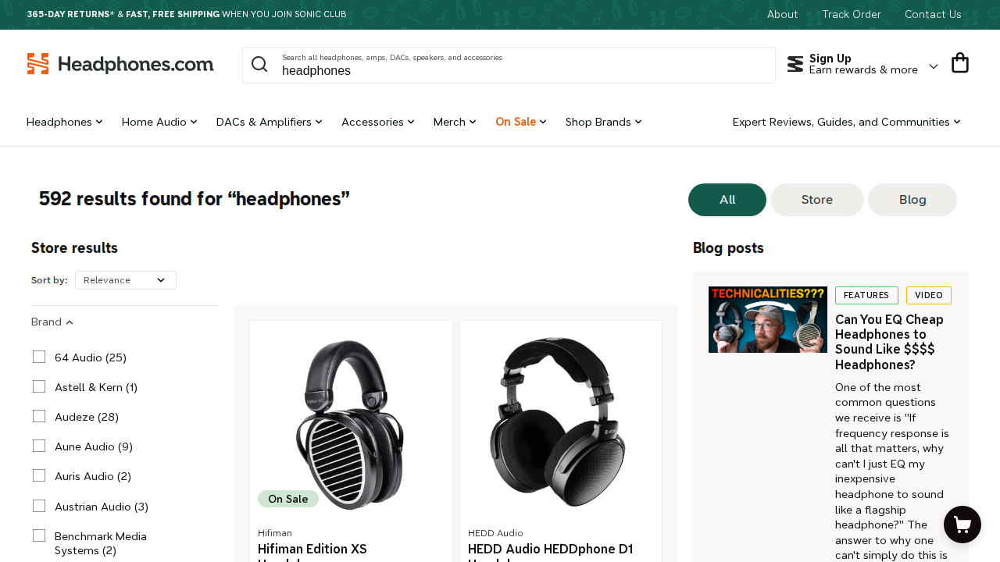
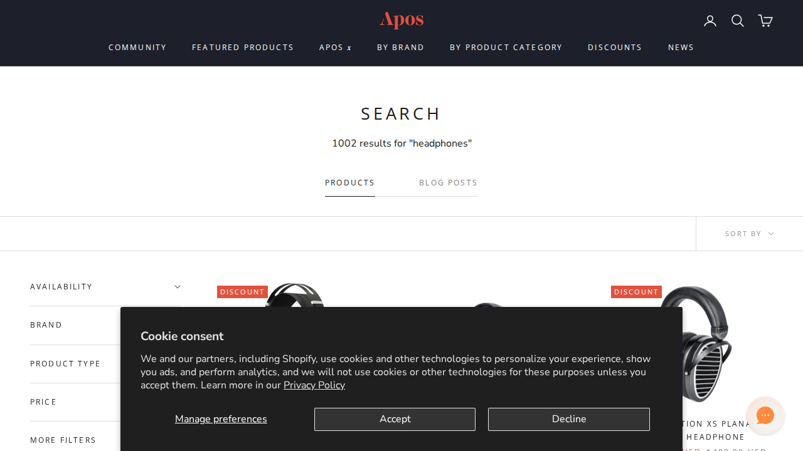
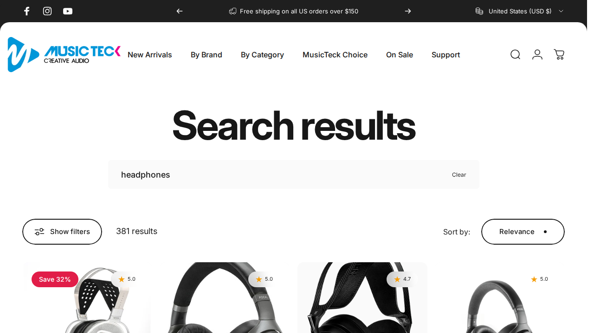
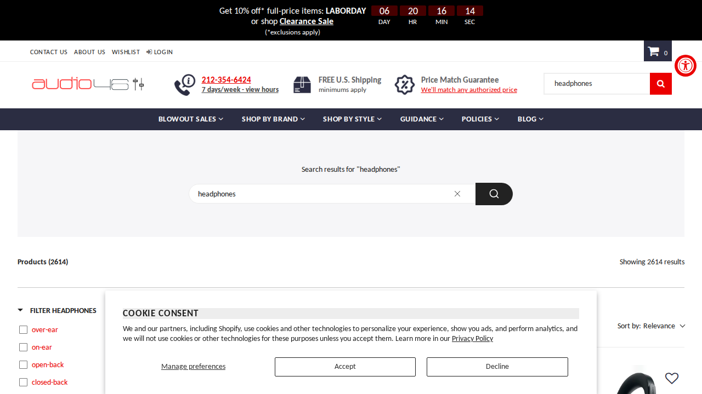
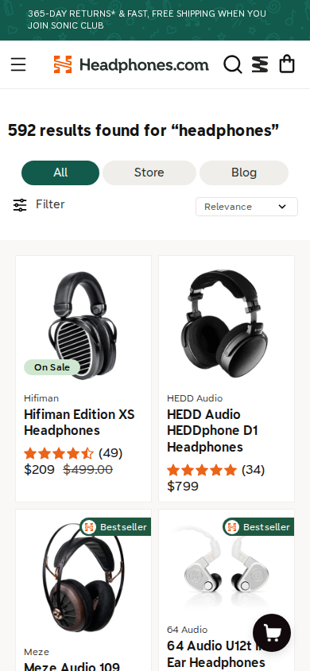
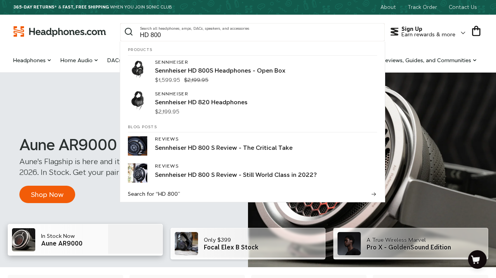
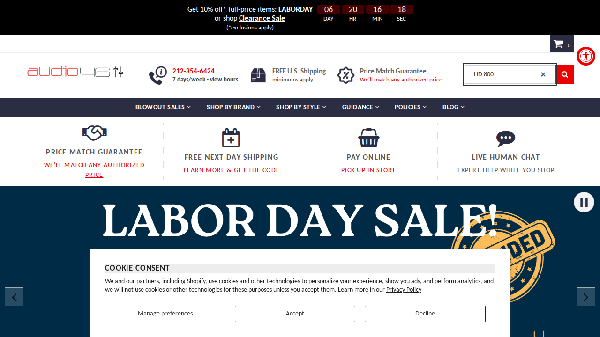

# Search UX — Visual & Perceptual Intelligence

Tracked by `sang-logium-d5m.6` — [Search] Intelligence: visual & perceptual UX standards  
Part of `sang-logium-d5m` — EPIC Search UX

This is the visual/perceptual addendum to `sang-logium-d5m.1`. It focuses on what a high-end audio-retail search experience should *look and feel* like, not on query handling. Visual findings are grounded in Baymard/NN/g research on visual hierarchy, trust signals and information density, plus real screenshots from competitor sites.

## Method

- Live competitor sites captured with Playwright, desktop (1280×720) and mobile (390×844) where applicable.
- Each retailer was opened on its homepage, a query was typed to surface the search box / autocomplete, and the results grid was captured for the query `headphones`.
- Screenshot evidence is in `docs/search-ux/evidence/screenshots/`.
- B&H was blocked by Cloudflare during the capture; its earlier functional data in `docs/search-ux/evidence/bnh-desktop.json` is used only for functional comparison, not for visual evidence.

## Standard sources

### Baymard Institute

- **Search field design & prominence.** The search field is not only an input; its size, contrast and placement signal how much the site "recommends" search as the primary product-finding strategy. A wide, high-contrast field with a clear search icon encourages users to search first, especially for spec-driven purchases like audio gear. ([E-Commerce Search Field Design and Its Implications](https://baymard.com/blog/search-field-design))
- **Search results layout.** A results page must answer three questions visually: (1) Did the site return any good matches? (2) Which of these are relevant to me? (3) Which product should I open? Poor layout makes users pogo-stick between results and product pages. ([Search Results Page design examples](https://baymard.com/ecommerce-design-examples/33-search-results-page))
- **Thumbnails in search results.** Users rely on product photos more than any other list attribute. List items need large, consistent, visually comparable product images. ([Secondary Hover Information](https://baymard.com/blog/secondary-hover-information))
- **Price clarity.** Price must be easy to scan; missing or de-emphasised prices force users to open product cards. ([Price Clarity in Product Lists and Search Results #452](https://baymard.com/guidelines/452-price-clarity-in-product-lists-and-search-results))

### Nielsen Norman Group

- **Trust & credibility.** A site communicates trustworthiness through (1) design quality/professionalism, (2) up-front disclosure, (3) comprehensive and current content, and (4) connection to the rest of the web. Visual professionalism is the first filter users apply. ([Trust or Bust: Communicating Trustworthiness in Web Design](https://www.nngroup.com/articles/communicating-trustworthiness/))
- **Trustworthiness in visual design.** A clean layout, meaningful navigation labels, appropriate color scheme, high-quality imagery and adequate white space all increase perceived value. Conversely, clutter, typos and broken links degrade credibility. ([Trustworthiness in Web Design: 4 Credibility Factors](https://www.nngroup.com/articles/trustworthy-design/))
- **Product photos on listing pages.** Photos should be large, consistent, specific and scannable so users can compare products without pogo-sticking. ([Product Photos on Listing Pages: 6 Tips](https://www.nngroup.com/articles/product-photos-listing-pages/))
- **List-entry hierarchy.** Each result card must expose the most important attributes first and use consistent styling to support side-by-side comparison. ([The Anatomy of a List Entry](https://www.nngroup.com/articles/list-entries/))

## Side-by-side: search field & results presentation

### Headphones.com

*Desktop, 1280×720. Search query: `headphones`.*

What the screenshot shows:
- **Search field** is wide, centered and high-contrast, with a search icon and descriptive placeholder.
- **Layout** separates Store results (left grid) from Blog posts (right column), so the user immediately sees the type of content available.
- **Product cards** have a clear hierarchy: large product image, brand name, product name, star rating with count, sale/original price.
- **Filters** are exposed in a left sidebar by brand.
- **Trust signals** include a top banner with "365-day returns & fast, free shipping" and the Sonic Club membership.

### Apos Audio

*Desktop, 1280×720. Search query: `headphones`.*

What the screenshot shows:
- **High-contrast dark header** with the Apos wordmark, account/cart icons and a search icon.
- **Results page** opens with a large "SEARCH" heading and a count.
- **Tabs** separate Products and Blog Posts.
- **Filter sidebar** lists Availability, Brand, Product Type and Price.
- **Visual density** is higher: discount badges, product thumbnails and the cookie-consent dialog partially obscure the first product row. The dialog is a visual disruption.

### MusicTeck

*Desktop, 1280×720. Search query: `headphones`.*

What the screenshot shows:
- **Massive "Search results" heading** establishes the page purpose immediately.
- **Search input** is prominent, shows the current query with a "Clear" control.
- **Filters** are collapsed behind a single "Show filters" pill, keeping the grid clean.
- **Product cards** display star ratings, a "Save X%" badge and a product image on a light background.
- **Trust/credibility**: a top bar advertises free shipping over $150 and the accepted payment icons in the footer reinforce legitimacy.

### Audio46

*Desktop, 1280×720. Search query: `headphones`.*

What the screenshot shows:
- **Dense header** with a phone number, price-match guarantee, free shipping and a search box.
- **Trust signal density** is the highest of the four: every pixel above the fold reinforces "authorized dealer / price match / free shipping."
- **Product cards** are not fully visible in the viewport, but the card style is more compact and catalogue-like.
- **Visual hierarchy** is utilitarian rather than premium; the design feels corporate and comparison-shopping oriented.

### Mobile comparison

*Mobile, 390×844.*

Headphones.com adapts the same hierarchy to mobile: the search field remains visible, results switch to a 1-column feed, badges ("On Sale", "Bestseller") and star ratings remain readable, and the filter is exposed as a single button.

## Autocomplete presentation

### Headphones.com

The autocomplete separates results into **Products** and **Blog Posts** sections, with a product thumbnail, brand, name, sale/original price and a "Search for 'HD 800'" bottom link. This is the most visually complete example in the sample.

### Audio46

Audio46 exposes a conventional top-bar search input but did not render a visible autocomplete dropdown for `HD 800` in the capture. The user must submit the query before seeing results.

### Apos and MusicTeck

Apos and MusicTeck both use an icon-driven or inline search pattern; a dropdown was not surfaced in the automated capture for `HD 800`. Their results-page search fields are shown in the screenshots above.

## Standards — visual & perceptual criteria for sanglogium

These criteria are derived from the Baymard/NN/g sources above and from the observed competitor patterns.

### 1. Search field must be visually dominant
- **Check:** on every page, the search input is at least as visually prominent as the category navigation; it is not reduced to a small icon.
- **Why:** audio shoppers often arrive with a specific model or spec in mind. A muted search field pushes them toward category browsing, which is slower for spec-driven purchases.
- **Benchmark:** Headphones.com and MusicTeck both give the search field high contrast and width; Apos hides it behind an icon at the top right.

### 2. Autocomplete must be visually rich and grouped
- **Check:** suggestions include a thumbnail, brand, product name and price; non-product matches (reviews, guides, policies) appear in clearly labeled sections; a "View all results" link is visible; an empty/no-match state offers recovery, not just "No products match."
- **Why:** thumbnails and structured grouping reduce the cognitive load of choosing the right query from the dropdown.
- **Benchmark:** Headphones.com meets this; Audio46 shows an input but no dropdown.

### 3. Product cards need a consistent, scannable hierarchy
- **Check:** every card presents image → brand → product name → price → availability/rating in the same order; image backgrounds are consistent (white or neutral); text alignment, font weights and spacing are identical across cards.
- **Why:** consistent styling lets users compare products at a glance without opening cards.
- **Benchmark:** Headphones.com and MusicTeck are the most consistent; Apos has more varied discount badges and card heights.

### 4. Price must be visible, current and scannable
- **Check:** price is shown on every card; sale price and original price are distinct; no card hides price behind a "See price in cart" or hover action.
- **Why:** price is a primary comparison attribute; forcing a click breaks the scan flow.
- **Benchmark:** all four retailers show prices directly on the result cards.

### 5. Trust signals must be visible but not visually noisy
- **Check:** a small set of high-value trust signals (return policy, shipping, price match, warranty) appears above the fold or on cards; the rest is relegated to the product page.
- **Why:** too many trust badges clutter the grid; too few reduce perceived security for high-ticket audio gear.
- **Benchmark:** Headphones.com uses a single top banner and badges on cards; Audio46 over-denses the header with multiple trust claims.

### 6. Filters must look like filters, not decoration
- **Check:** filters are in a clearly bounded sidebar or sheet; selected filters are visibly marked; on mobile they are batch-applied with an explicit action.
- **Why:** users with multiple criteria need confidence that their selections are being applied and can be reviewed.
- **Benchmark:** Headphones.com and Apos show a left filter sidebar; MusicTeck collapses them into a "Show filters" button.

### 7. Empty/no-results state must be visually helpful
- **Check:** the page states clearly that nothing was found, keeps the query visible, and offers concrete next steps (category links, related queries, support contact) rather than a single "No products found" message.
- **Why:** no-results is a high-risk abandonment point; the visual treatment should guide the user forward.
- **Benchmark:** this was not captured visually in the competitor session; sanglogium's own empty state is documented in `docs/search-ux/audit.md`.

### 8. Mobile must preserve the same hierarchy, not just stack desktop
- **Check:** on mobile, the search field remains findable, product cards remain a single readable column, filters move to a bottom/toggle sheet, and badges/prices remain legible without zoom.
- **Why:** mobile users are task-driven and less patient; a cramped or broken hierarchy increases abandonment.
- **Benchmark:** Headphones.com mobile keeps the search field, filter button and product-card hierarchy intact.

## Visual differences to act on

| Dimension | Headphones.com | MusicTeck | Apos | Audio46 |
|---|---|---|---|---|
| Search field prominence | High — wide, centered, icon + placeholder | High — large heading + input | Low — hidden behind icon | Medium — top bar |
| Results grid density | Moderate, two columns | Moderate, three columns | High, many badges | High, compact |
| Image treatment | Large, white/neutral background, consistent | Large, consistent | Varying card heights, cookie banner blocks | Smaller, catalogue style |
| Trust signals | Top banner + card badges | Free-shipping bar + payment icons in footer | Dark premium header, discount badges | Dense header trust claims |
| Filter placement | Left sidebar | Collapsed toggle | Left sidebar | Not visible in capture |
| Information hierarchy | Image → brand → name → price → rating | Image → badge → name → rating | Image → badge → name → price | Phone/shipping top, product grid below |

## Synthesis: target visual for sanglogium

A high-end audio search experience should:

1. **Prioritise the search field.** Treat it as the primary navigation element on desktop and mobile, with a wide, high-contrast input and a clear search icon.
2. **Make autocomplete useful, not just a list.** Show product thumbnails, brand, name, price and grouped non-product matches (reviews, guides, policies).
3. **Standardise product cards.** Consistent image size, neutral background, fixed attribute order (image, brand, name, price, rating, badge) and enough white space that cards don't compete with each other.
4. **Keep trust signals selective.** One or two high-value claims above the fold (e.g. returns, free shipping, price match), then move detailed guarantees to product pages.
5. **Expose filters visibly.** A left sidebar on desktop and a toggle/bottom sheet on mobile, with selected filters clearly marked.
6. **Preserve hierarchy on mobile.** Do not collapse the search field into a tiny icon; keep product cards readable in a single column and keep badges/prices legible.

## References

- Baymard Institute, [E-Commerce Search Field Design and Its Implications](https://baymard.com/blog/search-field-design)
- Baymard Institute, [Search Results Page design examples](https://baymard.com/ecommerce-design-examples/33-search-results-page)
- Baymard Institute, [Product Lists & Search Results Thumbnail Best Practices](https://baymard.com/blog/secondary-hover-information)
- Baymard Institute, [Price Clarity in Product Lists and Search Results #452](https://baymard.com/guidelines/452-price-clarity-in-product-lists-and-search-results)
- Nielsen Norman Group, [Trust or Bust: Communicating Trustworthiness in Web Design](https://www.nngroup.com/articles/communicating-trustworthiness/)
- Nielsen Norman Group, [Trustworthiness in Web Design: 4 Credibility Factors](https://www.nngroup.com/articles/trustworthy-design/)
- Nielsen Norman Group, [Product Photos on Listing Pages: 6 Tips](https://www.nngroup.com/articles/product-photos-listing-pages/)
- Nielsen Norman Group, [The Anatomy of a List Entry](https://www.nngroup.com/articles/list-entries/)
