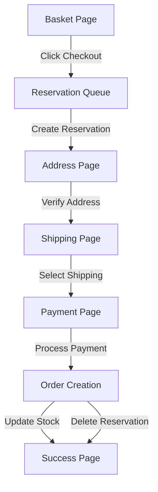

# Iteration 1: Initial Checkout Flow Development Plan

## Objective
Build a complete, production-ready checkout flow for sang-logium e-commerce platform that handles basket → address verification → shipping → payment → order completion with proper inventory reservation.

## Current State
- Checkout pages exist (shipping, payment, return) but lack implementation
- lib/checkout is empty
- Integration tests exist but implementation incomplete
- Dependencies: Stripe, Shippo, Google Address Validation, Sanity CMS

## Plan for Human Web Developer

### Phase 1: Core Infrastructure (Week 1)
1. **Implement inventory reservation system**
   - Create atomic reservation operation in lib/checkout/reservation.ts
   - Add Sanity document type for checkout reservations
   - Implement TTL-based reservation cleanup
   - Test: Verify stock is reserved and released correctly

2. **Build checkout queue system**
   - Set up BullMQ queue for reservation operations
   - Implement queue worker with error handling
   - Add queue monitoring and retry logic
   - Test: Verify queue processes reservations atomically

### Phase 2: Address Verification (Week 2)
1. **Integrate Google Address Validation API**
   - Create lib/checkout/addressValidation.ts
   - Implement address verification with fallback
   - Add address formatting for display
   - Test: Verify invalid addresses are rejected, valid ones pass

2. **Build address page UI**
   - Create form with real-time validation
   - Add address suggestion UI
   - Implement session storage for reservation ID
   - Test: E2e test from basket to address page

### Phase 3: Shipping Integration (Week 3)
1. **Integrate Shippo API**
   - Create lib/checkout/shipping.ts
   - Implement rate fetching with company/parcel data
   - Add shipping option selection logic
   - Test: Verify rates are fetched and displayed correctly

2. **Build shipping page UI**
   - Display shipping options with prices
   - Add selection persistence to reservation
   - Implement continue to payment flow
   - Test: E2e test from address to shipping page

### Phase 4: Payment Integration (Week 4)
1. **Integrate Stripe Elements**
   - Create lib/checkout/payment.ts
   - Implement Stripe Elements integration
   - Add payment intent creation with reservation data
   - Test: Verify payment intent is created correctly

2. **Build payment page UI**
   - Display Stripe Elements with billing address option
   - Add payment processing with loading states
   - Implement order creation on success
   - Test: E2e test complete checkout flow

### Phase 5: Order Completion (Week 5)
1. **Implement order creation**
   - Create lib/checkout/orderCreation.ts
   - Convert reservation to order with stock update
   - Delete reservation document after order creation
   - Test: Verify stock is updated, reservation is deleted

2. **Build return/success page**
   - Display order details
   - Add success message
   - Implement order tracking link
   - Test: E2e test complete flow to success page

## Success Criteria
- All E2E tests pass from basket to success page
- Inventory reservation is atomic and reliable
- Address validation rejects invalid addresses
- Shipping rates are fetched correctly
- Payment processing completes successfully
- Orders are created with correct stock updates

## Diagram

## Verification Steps
1. Run E2E test: `npm run test:checkout`
2. Verify inventory reservation in Sanity
3. Test address validation with invalid address
4. Verify shipping rates are fetched
5. Test payment with Stripe test card
6. Verify order creation in Sanity
