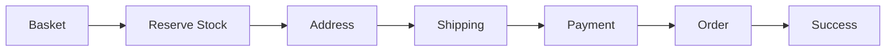

# Iteration 2: Refined Checkout Flow Plan

**Improvement over Iteration 1:** Reduced scope to MVP, added specific SWE 1.6 guidance, prioritized existing infrastructure, simplified diagram.

## Objective
Guide SWE 1.6 to build MVP checkout flow using existing test infrastructure and Sanity CMS. Focus on least costly pathway with maximum impact.

## How to Guide SWE 1.6

### Command Pattern
Use specific, test-driven commands:
- "Implement inventory reservation following test in tests/checkout/e2e/guest-checkout-inventory-reservation/"
- "Build address page matching the E2E test expectations"
- "Integrate Shippo API using existing test data in tests/checkout/test-data/"

### Verification First
Always require SWE 1.6 to:
1. Read the existing test first
2. Run the test to see what fails
3. Implement minimum code to pass test
4. Re-run test to verify

### Leverage Existing Code
- Use existing basket store (store/basketStore.ts)
- Use existing Sanity client (sanity-config/lib/client.ts)
- Use existing Stripe setup (lib/stripe.ts)
- Use existing test infrastructure (playwright.checkout.config.ts)

## Minimal Implementation Plan

### Step 1: Inventory Reservation (Day 1-2)
**Command:** "Implement atomic inventory reservation that passes tests/checkout/e2e/guest-checkout-inventory-reservation/"

**What to verify:**
- Reservation document created in Sanity
- Stock reserved atomically
- Reservation expires after TTL

**SWE 1.6 should:**
1. Read existing E2E test
2. Create lib/checkout/reservation.ts
3. Implement reservation logic
4. Run test to verify

### Step 2: Address Page (Day 3)
**Command:** "Build address page that validates address with Google API and saves to reservation"

**What to verify:**
- Address form renders
- Invalid addresses rejected
- Valid addresses saved to reservation

**SWE 1.6 should:**
1. Create app/(store)/checkout/shipping/page.tsx
2. Integrate Google Address Validation
3. Update reservation document
4. Run E2E test to verify

### Step 3: Shipping Options (Day 4)
**Command:** "Integrate Shippo API to fetch and display shipping rates"

**What to verify:**
- Rates fetched from Shippo
- Options displayed to user
- Selection saved to reservation

**SWE 1.6 should:**
1. Create lib/checkout/shipping.ts
2. Integrate Shippo API
3. Build shipping options UI
4. Run E2E test to verify

### Step 4: Payment (Day 5)
**Command:** "Integrate Stripe Elements for payment processing"

**What to verify:**
- Stripe Elements renders
- Payment processes successfully
- Order created on success

**SWE 1.6 should:**
1. Create app/(store)/checkout/payment/page.tsx
2. Integrate Stripe Elements
3. Create order on payment success
4. Run E2E test to verify

### Step 5: Success Page (Day 6)
**Command:** "Build success page displaying order details"

**What to verify:**
- Order details displayed
- Reservation deleted
- Stock updated

**SWE 1.6 should:**
1. Create app/(store)/checkout/return/page.tsx
2. Display order details
3. Verify cleanup
4. Run full E2E test

## Success Criteria
- All E2E tests pass: `npm run test:checkout`
- Each step verified before moving to next
- No implementation without passing test

## Diagram

## Verification Commands
- After each step: `npm run test:checkout:quick`
- Full verification: `npm run test:checkout`
- Type check: `npm run ts-check`
