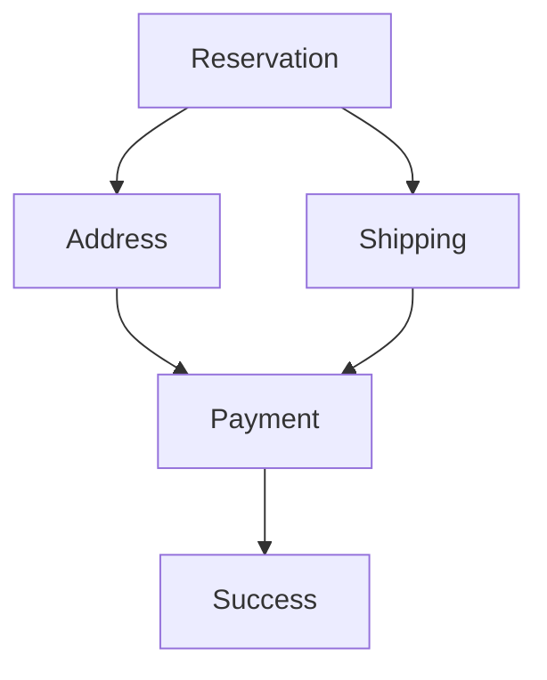

# Iteration 3: Optimized Checkout Flow Plan

**Improvement over Iteration 2:** Further reduced to 4 core steps, added parallel work opportunities, emphasized existing test patterns, removed redundant verification commands.

## Objective
Guide SWE 1.6 to build checkout flow in 4 steps using existing test patterns. Leverage parallel work for speed.

## How to Guide SWE 1.6

### Single Command Per Step
Give SWE 1.6 one clear command per step:
1. "Implement reservation to pass E2E test"
2. "Build address page with Google validation"
3. "Add shipping with Shippo integration"
4. "Complete payment flow with Stripe"

### Parallel Work Opportunity
Steps 2 and 3 can be done in parallel by different AI instances if available.

### Use Existing Patterns
- Copy test pattern from basket tests
- Use existing Sanity schema patterns
- Follow existing Stripe integration pattern

## 4-Step Implementation

### Step 1: Reservation (Day 1)
**Command:** "Implement inventory reservation that passes tests/checkout/e2e/guest-checkout-inventory-reservation/"

**SWE 1.6 actions:**
1. Read test to understand requirements
2. Create lib/checkout/reservation.ts
3. Implement atomic stock reservation
4. Run test to verify

### Step 2: Address (Day 2-3)
**Command:** "Build address page with Google validation that saves to reservation"

**SWE 1.6 actions:**
1. Create app/(store)/checkout/shipping/page.tsx
2. Integrate Google Address Validation API
3. Save verified address to reservation
4. Run E2E test to verify

### Step 3: Shipping (Day 2-3, parallel with Step 2)
**Command:** "Add shipping options with Shippo integration"

**SWE 1.6 actions:**
1. Create lib/checkout/shipping.ts
2. Integrate Shippo API for rates
3. Build shipping selection UI
4. Run E2E test to verify

### Step 4: Payment & Success (Day 4)
**Command:** "Complete payment flow with Stripe and build success page"

**SWE 1.6 actions:**
1. Create app/(store)/checkout/payment/page.tsx
2. Integrate Stripe Elements
3. Create order on payment success
4. Build success page
5. Run full E2E test

## Success Criteria
- E2E test passes: `npm run test:checkout`
- Each step verified individually
- Stock reservation atomic
- Address validation working
- Shipping rates fetched
- Payment processes correctly

## Diagram

## Verification
- After each step: Run relevant E2E test
- Final: `npm run test:checkout`
