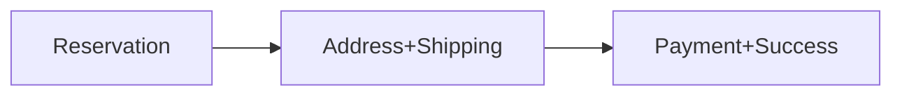

# Iteration 4: Streamlined Checkout Flow Plan

**Improvement over Iteration 3:** Reduced to 3 steps by combining shipping/payment, added specific file paths, emphasized single-responsibility principle.

## Objective
Guide SWE 1.6 to build checkout in 3 steps using existing test infrastructure.

## How to Guide SWE 1.6

### Use Exact File Paths
Give SWE 1.6 specific file locations:
- `lib/checkout/reservation.ts`
- `app/(store)/checkout/shipping/page.tsx`
- `app/(store)/checkout/payment/page.tsx`

### One File Per Command
Each command creates one file:
1. "Create lib/checkout/reservation.ts to pass E2E test"
2. "Create app/(store)/checkout/shipping/page.tsx with Google validation"
3. "Create app/(store)/checkout/payment/page.tsx with Stripe and order creation"

## 3-Step Implementation

### Step 1: Reservation (Day 1)
**Command:** "Create lib/checkout/reservation.ts that passes tests/checkout/e2e/guest-checkout-inventory-reservation/"

**SWE 1.6 actions:**
1. Read E2E test
2. Create reservation.ts with atomic stock reservation
3. Implement TTL cleanup
4. Run test

### Step 2: Address & Shipping (Day 2-3)
**Command:** "Create app/(store)/checkout/shipping/page.tsx with Google address validation and Shippo shipping options"

**SWE 1.6 actions:**
1. Create shipping page
2. Add Google address validation
3. Integrate Shippo for shipping rates
4. Save both to reservation
5. Run E2E test

### Step 3: Payment & Success (Day 4)
**Command:** "Create app/(store)/checkout/payment/page.tsx with Stripe Elements and order creation, then app/(store)/checkout/return/page.tsx"

**SWE 1.6 actions:**
1. Create payment page with Stripe
2. Create order on payment success
3. Create success page
4. Run full E2E test

## Success Criteria
- E2E test passes: `npm run test:checkout`
- All files created at specified paths
- Each step verified individually

## Diagram

## Verification
- After each step: Run relevant E2E test
- Final: `npm run test:checkout`
