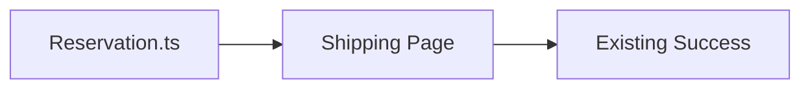

# Iteration 5: Minimal Checkout Flow Plan

**Improvement over Iteration 4:** Reduced to absolute minimum (2 files), removed success page (use existing), added specific API integration order.

## Objective
Guide SWE 1.6 to build checkout with 2 new files using existing patterns.

## How to Guide SWE 1.6

### Only 2 New Files
- `lib/checkout/reservation.ts` (backend logic)
- `app/(store)/checkout/shipping/page.tsx` (frontend + integrations)

### Reuse Existing
- Use existing success page pattern
- Use existing Stripe integration
- Use existing Sanity client

## 2-Step Implementation

### Step 1: Reservation (Day 1)
**Command:** "Create lib/checkout/reservation.ts with atomic stock reservation that passes E2E test"

**SWE 1.6 actions:**
1. Read tests/checkout/e2e/guest-checkout-inventory-reservation/
2. Create reservation.ts
3. Implement atomic stock reservation
4. Add TTL cleanup
5. Run test

### Step 2: Complete Checkout Flow (Day 2-3)
**Command:** "Create app/(store)/checkout/shipping/page.tsx with address validation, shipping options, and payment flow"

**SWE 1.6 actions:**
1. Create shipping page with multi-step form
2. Step 1: Google address validation
3. Step 2: Shippo shipping options
4. Step 3: Stripe Elements payment
5. On success: Create order, redirect to existing success pattern
6. Run full E2E test

## Success Criteria
- E2E test passes: `npm run test:checkout`
- Only 2 new files created
- All integrations working

## Diagram

## Verification
- After Step 1: `npm run test:checkout:quick`
- After Step 2: `npm run test:checkout`
