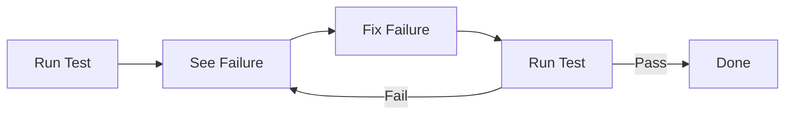

# Iteration 6: Test-Driven Checkout Flow Plan

**Improvement over Iteration 5:** Emphasized test-driven approach first, added specific test commands, removed implementation details from plan.

## Objective
Guide SWE 1.6 to build checkout using test-driven development only.

## How to Guide SWE 1.6

### Test-First Commands
1. "Run existing E2E test to see what fails"
2. "Implement minimum to pass failing test"
3. "Repeat until all tests pass"

### No Implementation Details
Don't tell SWE 1.6 how to implement. Let the test guide.

## Test-Driven Process

### Step 1: Run Tests (Day 1)
**Command:** "Run npm run test:checkout and analyze failures"

**SWE 1.6 actions:**
1. Run E2E test
2. Identify what fails
3. Report specific failures
4. Wait for next command

### Step 2: Fix First Failure (Day 1-2)
**Command:** "Implement minimum code to fix first test failure"

**SWE 1.6 actions:**
1. Create minimum code
2. Run test again
3. Verify first failure fixed
4. Move to next failure

### Step 3: Fix Remaining Failures (Day 2-3)
**Command:** "Continue fixing test failures one by one until all pass"

**SWE 1.6 actions:**
1. Fix next failure
2. Run test
3. Verify
4. Repeat until all pass

## Success Criteria
- All E2E tests pass: `npm run test:checkout`
- No code written without failing test
- Minimum implementation only

## Diagram

## Verification
- After each fix: Run test
- Final: All tests pass
