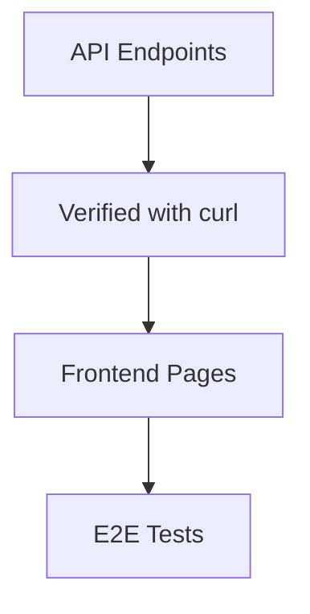

# Iteration 7: API-First Checkout Flow Plan

**Improvement over Iteration 6:** Changed to API-first approach, separated backend from frontend, added API verification steps.

## Objective
Guide SWE 1.6 to build checkout API first, then frontend.

## How to Guide SWE 1.6

### API-First Commands
1. "Build API endpoints for checkout operations"
2. "Verify API with curl/Postman"
3. "Build frontend to call API"

### Separate Concerns
Backend API first, then frontend UI.

## API-First Process

### Step 1: Reservation API (Day 1)
**Command:** "Create API endpoint for inventory reservation at app/api/checkout/reservation/route.ts"

**SWE 1.6 actions:**
1. Create POST /api/checkout/reservation
2. Implement atomic stock reservation
3. Return reservation ID
4. Test with curl

### Step 2: Address API (Day 2)
**Command:** "Create API endpoint for address validation at app/api/checkout/address/route.ts"

**SWE 1.6 actions:**
1. Create POST /api/checkout/address
2. Integrate Google Address Validation
3. Save to reservation
4. Test with curl

### Step 3: Shipping API (Day 2)
**Command:** "Create API endpoint for shipping rates at app/api/checkout/shipping/route.ts"

**SWE 1.6 actions:**
1. Create POST /api/checkout/shipping
2. Integrate Shippo API
3. Return rates
4. Test with curl

### Step 4: Payment API (Day 3)
**Command:** "Create API endpoint for payment at app/api/checkout/payment/route.ts"

**SWE 1.6 actions:**
1. Create POST /api/checkout/payment
2. Integrate Stripe
3. Create order
4. Test with curl

### Step 5: Frontend (Day 4)
**Command:** "Build frontend pages that call the API endpoints"

**SWE 1.6 actions:**
1. Create shipping page calling APIs
2. Add loading states
3. Handle errors
4. Run E2E test

## Success Criteria
- All API endpoints tested with curl
- E2E test passes: `npm run test:checkout`
- Frontend calls APIs correctly

## Diagram

## Verification
- After each API: Test with curl
- Final: `npm run test:checkout`
