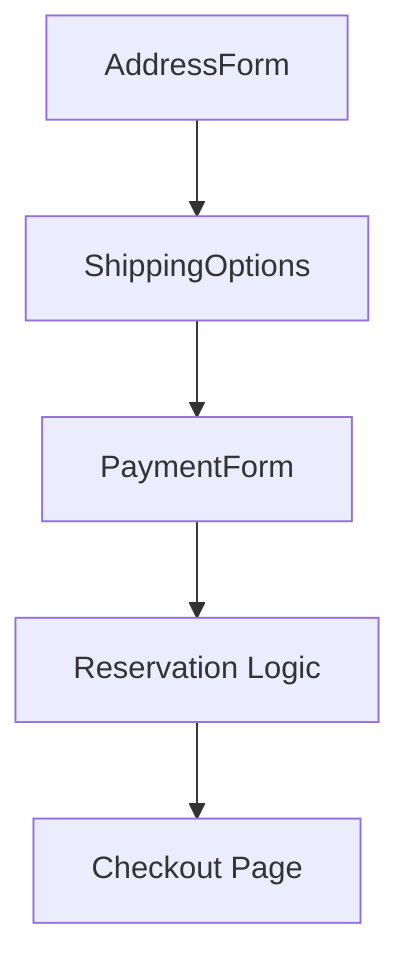

# Iteration 8: Component-Based Checkout Flow Plan

**Improvement over Iteration 7:** Changed to component-based approach, added reusable components, emphasized composition over monolithic pages.

## Objective
Guide SWE 1.6 to build checkout using reusable components.

## How to Guide SWE 1.6

### Component Commands
1. "Create AddressForm component"
2. "Create ShippingOptions component"
3. "Create PaymentForm component"
4. "Compose components in checkout page"

### Reuse Components
Build once, use across checkout flow.

## Component-Based Process

### Step 1: AddressForm Component (Day 1)
**Command:** "Create components/checkout/AddressForm.tsx with Google validation"

**SWE 1.6 actions:**
1. Create AddressForm component
2. Add Google Address Validation
3. Add validation UI
4. Test component in isolation

### Step 2: ShippingOptions Component (Day 2)
**Command:** "Create components/checkout/ShippingOptions.tsx with Shippo integration"

**SWE 1.6 actions:**
1. Create ShippingOptions component
2. Integrate Shippo API
3. Display rates
4. Test component in isolation

### Step 3: PaymentForm Component (Day 3)
**Command:** "Create components/checkout/PaymentForm.tsx with Stripe Elements"

**SWE 1.6 actions:**
1. Create PaymentForm component
2. Integrate Stripe Elements
3. Add billing address option
4. Test component in isolation

### Step 4: Reservation Logic (Day 3)
**Command:** "Create lib/checkout/reservation.ts for backend logic"

**SWE 1.6 actions:**
1. Create reservation logic
2. Add atomic stock reservation
3. Add TTL cleanup
4. Test with unit tests

### Step 5: Compose Checkout Page (Day 4)
**Command:** "Create app/(store)/checkout/shipping/page.tsx composing all components"

**SWE 1.6 actions:**
1. Import components
2. Add multi-step flow
3. Handle state between steps
4. Run E2E test

## Success Criteria
- Each component testable in isolation
- E2E test passes: `npm run test:checkout`
- Components reusable

## Diagram

## Verification
- After each component: Test in isolation
- Final: `npm run test:checkout`
