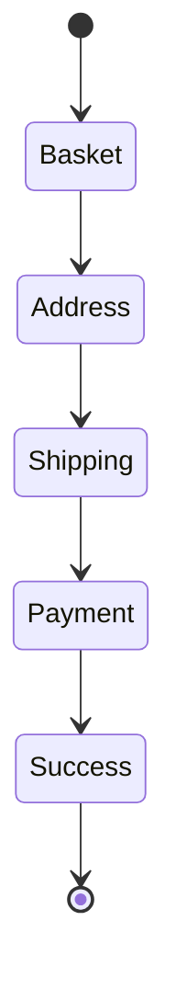

# Iteration 9: State Machine Checkout Flow Plan

**Improvement over Iteration 8:** Changed to state machine approach, added explicit states, emphasized transition validation.

## Objective
Guide SWE 1.6 to build checkout using state machine pattern.

## How to Guide SWE 1.6

### State Machine Commands
1. "Define checkout states and transitions"
2. "Implement state machine with validation"
3. "Build UI for each state"
4. "Enforce valid transitions only"

### Explicit States
No implicit state changes. All transitions validated.

## State Machine Process

### Step 1: Define States (Day 1)
**Command:** "Create lib/checkout/states.ts with checkout state machine"

**SWE 1.6 actions:**
1. Define states: BASKET, ADDRESS, SHIPPING, PAYMENT, SUCCESS
2. Define valid transitions
3. Add transition validation
4. Add state persistence

### Step 2: Reservation Logic (Day 1-2)
**Command:** "Create lib/checkout/reservation.ts with state-aware reservation"

**SWE 1.6 actions:**
1. Create reservation tied to state
2. Add atomic stock reservation
3. Add state transitions on operations
4. Test state transitions

### Step 3: State-Based API (Day 2)
**Command:** "Create API endpoints that enforce state transitions at app/api/checkout/[state]/route.ts"

**SWE 1.6 actions:**
1. Create state-based API
2. Validate transitions before allowing
3. Return current state
4. Test with invalid transitions

### Step 4: State-Based UI (Day 3-4)
**Command:** "Create checkout page that follows state machine"

**SWE 1.6 actions:**
1. Create UI for each state
2. Disable invalid transitions
3. Show current state
4. Run E2E test

## Success Criteria
- Invalid transitions rejected
- E2E test passes: `npm run test:checkout`
- State always valid

## Diagram

## Verification
- Test invalid transitions
- Final: `npm run test:checkout`
