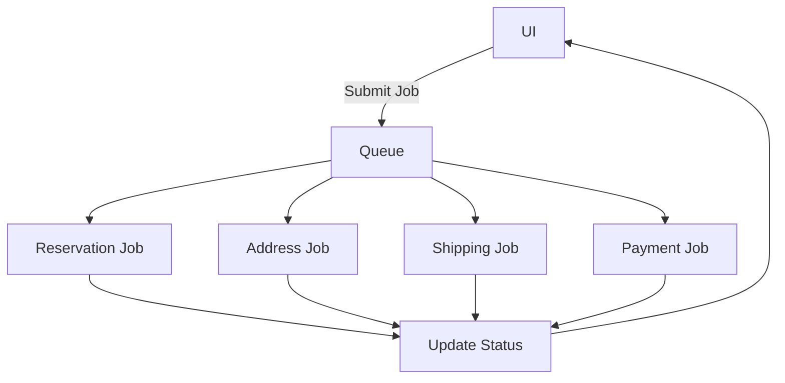

# Iteration 10: Queue-Based Checkout Flow Plan

**Improvement over Iteration 9:** Changed to queue-based approach, emphasized BullMQ for async operations, added job status tracking.

## Objective
Guide SWE 1.6 to build checkout using queue-based async operations.

## How to Guide SWE 1.6

### Queue Commands
1. "Set up BullMQ queue for checkout operations"
2. "Create jobs for each checkout step"
3. "Track job status in UI"
4. "Handle job failures with retries"

### Async Operations
All heavy operations go through queue.

## Queue-Based Process

### Step 1: Queue Setup (Day 1)
**Command:** "Create lib/checkout/queue.ts with BullMQ setup"

**SWE 1.6 actions:**
1. Set up BullMQ queue
2. Create job processors
3. Add retry logic
4. Add job status tracking

### Step 2: Reservation Job (Day 1-2)
**Command:** "Create reservation job processor with atomic stock reservation"

**SWE 1.6 actions:**
1. Create reservation job
2. Implement atomic stock reservation
3. Add job completion callback
4. Test job execution

### Step 3: Address Validation Job (Day 2)
**Command:** "Create address validation job processor with Google API"

**SWE 1.6 actions:**
1. Create address validation job
2. Integrate Google API
3. Save result to reservation
4. Test job execution

### Step 4: Shipping Job (Day 2-3)
**Command:** "Create shipping rates job processor with Shippo API"

**SWE 1.6 actions:**
1. Create shipping rates job
2. Integrate Shippo API
3. Save rates to reservation
4. Test job execution

### Step 5: Payment Job (Day 3)
**Command:** "Create payment job processor with Stripe integration"

**SWE 1.6 actions:**
1. Create payment job
2. Integrate Stripe
3. Create order on success
4. Test job execution

### Step 6: Job-Based UI (Day 4)
**Command:** "Create checkout page that submits jobs and tracks status"

**SWE 1.6 actions:**
1. Create job submission UI
2. Add job status polling
3. Show progress
4. Run E2E test

## Success Criteria
- All operations queued
- Job status tracked
- E2E test passes: `npm run test:checkout`

## Diagram

## Verification
- Test job execution
- Test job failures
- Final: `npm run test:checkout`
