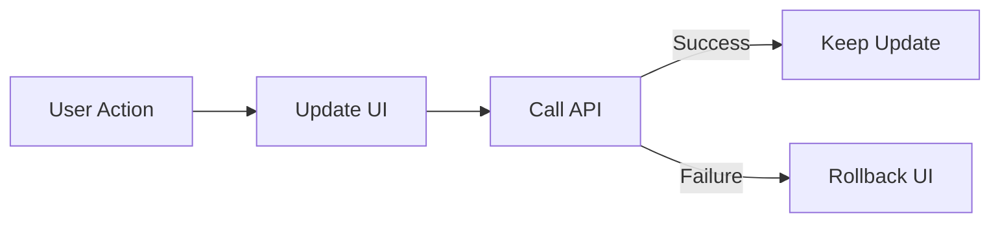

# Iteration 11: Optimistic UI Checkout Flow Plan

**Improvement over Iteration 10:** Changed to optimistic UI approach, removed queue complexity, added immediate feedback with rollback.

## Objective
Guide SWE 1.6 to build checkout with optimistic UI for speed.

## How to Guide SWE 1.6

### Optimistic UI Commands
1. "Update UI immediately on user action"
2. "Rollback on API failure"
3. "Show loading states during API calls"
4. "Handle conflicts gracefully"

### Immediate Feedback
No waiting for API confirmation before UI update.

## Optimistic UI Process

### Step 1: Reservation (Day 1)
**Command:** "Create lib/checkout/reservation.ts with optimistic stock reservation"

**SWE 1.6 actions:**
1. Create reservation function
2. Optimistically reserve stock in UI
3. Call API in background
4. Rollback on failure

### Step 2: Address Form (Day 2)
**Command:** "Create address form with optimistic validation"

**SWE 1.6 actions:**
1. Create address form
2. Show valid immediately
3. Validate in background
4. Show error if invalid

### Step 3: Shipping Options (Day 2-3)
**Command:** "Create shipping options with optimistic selection"

**SWE 1.6 actions:**
1. Create shipping options UI
2. Show selection immediately
3. Save in background
4. Handle conflicts

### Step 4: Payment (Day 3)
**Command:** "Create payment form with optimistic processing"

**SWE 1.6 actions:**
1. Create payment form
2. Show success immediately
3. Process in background
4. Rollback on failure

### Step 5: Error Handling (Day 4)
**Command:** "Add comprehensive error handling and rollback logic"

**SWE 1.6 actions:**
1. Add rollback functions
2. Show error messages
3. Allow retry
4. Run E2E test

## Success Criteria
- UI updates immediately
- Rollbacks work correctly
- E2E test passes: `npm run test:checkout`

## Diagram

## Verification
- Test optimistic updates
- Test rollback scenarios
- Final: `npm run test:checkout`
