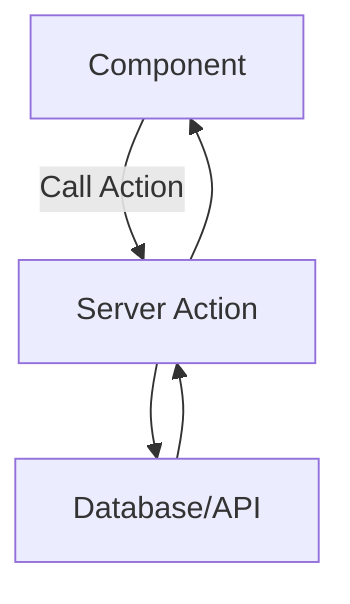

# Iteration 12: Server Action Checkout Flow Plan

**Improvement over Iteration 11:** Changed to Next.js Server Actions, removed API routes, simplified backend logic.

## Objective
Guide SWE 1.6 to build checkout using Next.js Server Actions.

## How to Guide SWE 1.6

### Server Action Commands
1. "Create server actions for checkout operations"
2. "Call actions directly from components"
3. "Use revalidatePath for cache updates"
4. "Handle errors with useActionState"

### No API Routes
Use Server Actions instead of REST API.

## Server Action Process

### Step 1: Reservation Action (Day 1)
**Command:** "Create app/actions/checkout/reservation.ts server action"

**SWE 1.6 actions:**
1. Create reserveStock server action
2. Implement atomic stock reservation
3. Add validation
4. Test with action call

### Step 2: Address Action (Day 2)
**Command:** "Create app/actions/checkout/address.ts server action"

**SWE 1.6 actions:**
1. Create validateAddress server action
2. Integrate Google API
3. Save to reservation
4. Test with action call

### Step 3: Shipping Action (Day 2)
**Command:** "Create app/actions/checkout/shipping.ts server action"

**SWE 1.6 actions:**
1. Create getShippingRates server action
2. Integrate Shippo API
3. Return rates
4. Test with action call

### Step 4: Payment Action (Day 3)
**Command:** "Create app/actions/checkout/payment.ts server action"

**SWE 1.6 actions:**
1. Create processPayment server action
2. Integrate Stripe
3. Create order
4. Test with action call

### Step 5: Checkout Page (Day 4)
**Command:** "Create checkout page using server actions"

**SWE 1.6 actions:**
1. Import server actions
2. Call actions from forms
3. Handle errors
4. Run E2E test

## Success Criteria
- Server actions work
- E2E test passes: `npm run test:checkout`
- No API routes needed

## Diagram

## Verification
- Test each server action
- Final: `npm run test:checkout`
