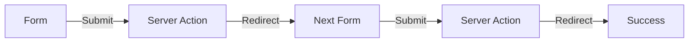

# Iteration 13: Form Action Checkout Flow Plan

**Improvement over Iteration 12:** Changed to native HTML form actions, removed client-side state, emphasized progressive enhancement.

## Objective
Guide SWE 1.6 to build checkout using native HTML form actions.

## How to Guide SWE 1.6

### Form Action Commands
1. "Create HTML forms with server actions"
2. "Use native form validation"
3. "Add progressive enhancement"
4. "Handle redirects properly"

### No Client-Side State
Use native HTML forms only.

## Form Action Process

### Step 1: Reservation Form (Day 1)
**Command:** "Create reservation form with server action at app/(store)/checkout/reservation/page.tsx"

**SWE 1.6 actions:**
1. Create HTML form
2. Add server action
3. Implement reservation logic
4. Test form submission

### Step 2: Address Form (Day 2)
**Command:** "Create address form with server action at app/(store)/checkout/address/page.tsx"

**SWE 1.6 actions:**
1. Create HTML form
2. Add Google validation in action
3. Save to reservation
4. Test form submission

### Step 3: Shipping Form (Day 2-3)
**Command:** "Create shipping form with server action at app/(store)/checkout/shipping/page.tsx"

**SWE 1.6 actions:**
1. Create HTML form
2. Add Shippo integration in action
3. Display rates
4. Test form submission

### Step 4: Payment Form (Day 3)
**Command:** "Create payment form with server action at app/(store)/checkout/payment/page.tsx"

**SWE 1.6 actions:**
1. Create HTML form
2. Add Stripe Elements
3. Process payment in action
4. Test form submission

### Step 5: Success Page (Day 4)
**Command:** "Create success page at app/(store)/checkout/success/page.tsx"

**SWE 1.6 actions:**
1. Create success page
2. Display order details
3. Run E2E test

## Success Criteria
- Forms work without JavaScript
- E2E test passes: `npm run test:checkout`
- Progressive enhancement works

## Diagram

## Verification
- Test forms with JS disabled
- Final: `npm run test:checkout`
