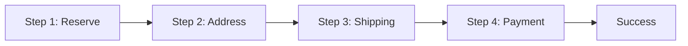

# Iteration 14: Single-Page Checkout Flow Plan

**Improvement over Iteration 13:** Changed to single-page checkout, removed page redirects, added step-based UI.

## Objective
Guide SWE 1.6 to build checkout as single page with steps.

## How to Guide SWE 1.6

### Single-Page Commands
1. "Create single checkout page with steps"
2. "Show/hide steps based on progress"
3. "Save state in URL or session"
4. "Handle step transitions"

### No Page Redirects
All checkout steps on one page.

## Single-Page Process

### Step 1: Checkout Page Structure (Day 1)
**Command:** "Create app/(store)/checkout/page.tsx with step-based layout"

**SWE 1.6 actions:**
1. Create single page
2. Add step indicators
3. Add step containers
4. Add navigation buttons

### Step 2: Reservation Step (Day 1-2)
**Command:** "Add reservation step to checkout page"

**SWE 1.6 actions:**
1. Add reservation form
2. Implement reservation logic
3. Show success message
4. Move to next step

### Step 3: Address Step (Day 2)
**Command:** "Add address step with Google validation"

**SWE 1.6 actions:**
1. Add address form
2. Integrate Google API
3. Validate before next step
4. Save to reservation

### Step 4: Shipping Step (Day 2-3)
**Command:** "Add shipping step with Shippo integration"

**SWE 1.6 actions:**
1. Add shipping options
2. Integrate Shippo API
3. Select shipping option
4. Save to reservation

### Step 5: Payment Step (Day 3-4)
**Command:** "Add payment step with Stripe Elements"

**SWE 1.6 actions:**
1. Add payment form
2. Integrate Stripe
3. Process payment
4. Show success message

### Step 6: Success State (Day 4)
**Command:** "Add success state to checkout page"

**SWE 1.6 actions:**
1. Hide all steps
2. Show success message
3. Display order details
4. Run E2E test

## Success Criteria
- All steps on one page
- E2E test passes: `npm run test:checkout`
- Step transitions work

## Diagram

## Verification
- Test step transitions
- Final: `npm run test:checkout`
