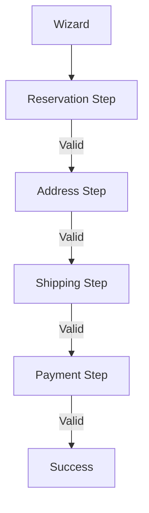

# Iteration 15: Wizard Checkout Flow Plan

**Improvement over Iteration 14:** Changed to wizard pattern, added step validation, emphasized completion before progression.

## Objective
Guide SWE 1.6 to build checkout using wizard pattern with validation.

## How to Guide SWE 1.6

### Wizard Commands
1. "Create wizard with step validation"
2. "Prevent progression until step complete"
3. "Show step progress"
4. "Allow step navigation"

### Validation Before Progression
Each step must be valid before next step.

## Wizard Process

### Step 1: Wizard Structure (Day 1)
**Command:** "Create components/checkout/CheckoutWizard.tsx with step management"

**SWE 1.6 actions:**
1. Create wizard component
2. Add step state
3. Add validation state
4. Add navigation controls

### Step 2: Reservation Step (Day 1-2)
**Command:** "Create ReservationStep component with validation"

**SWE 1.6 actions:**
1. Create step component
2. Add reservation form
3. Validate reservation
4. Enable next step on success

### Step 3: Address Step (Day 2)
**Command:** "Create AddressStep component with Google validation"

**SWE 1.6 actions:**
1. Create step component
2. Add address form
3. Validate with Google API
4. Enable next step on valid address

### Step 4: Shipping Step (Day 2-3)
**Command:** "Create ShippingStep component with Shippo integration"

**SWE 1.6 actions:**
1. Create step component
2. Add shipping options
3. Validate selection
4. Enable next step on selection

### Step 5: Payment Step (Day 3-4)
**Command:** "Create PaymentStep component with Stripe integration"

**SWE 1.6 actions:**
1. Create step component
2. Add payment form
3. Validate payment
4. Enable completion on success

### Step 6: Checkout Page (Day 4)
**Command:** "Create checkout page using CheckoutWizard"

**SWE 1.6 actions:**
1. Import wizard
2. Add steps
3. Add success state
4. Run E2E test

## Success Criteria
- Steps validate before progression
- E2E test passes: `npm run test:checkout`
- Wizard navigation works

## Diagram

## Verification
- Test invalid step blocking
- Final: `npm run test:checkout`
