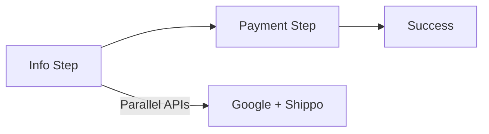

# Iteration 16: Accelerated Checkout Flow Plan

**Improvement over Iteration 15:** Reduced to 2 steps by combining address/shipping, added parallel API calls, emphasized speed.

## Objective
Guide SWE 1.6 to build accelerated checkout with minimal steps.

## How to Guide SWE 1.6

### Accelerated Commands
1. "Combine address and shipping into one step"
2. "Make API calls in parallel"
3. "Use browser caching for rates"
4. "Preload data where possible"

### Minimal Steps
Only 2 steps: Info + Payment.

## Accelerated Process

### Step 1: Combined Info Step (Day 1-2)
**Command:** "Create single info step with address and shipping combined"

**SWE 1.6 actions:**
1. Create form with address + shipping
2. Call Google API and Shippo in parallel
3. Cache shipping rates
4. Save all to reservation

### Step 2: Payment Step (Day 2-3)
**Command:** "Create payment step with Stripe"

**SWE 1.6 actions:**
1. Create payment form
2. Preload Stripe Elements
3. Process payment
4. Create order

### Step 3: Success (Day 3)
**Command:** "Create success page"

**SWE 1.6 actions:**
1. Create success page
2. Display order details
3. Run E2E test

## Success Criteria
- Only 2 steps for user
- API calls parallel
- E2E test passes: `npm run test:checkout`

## Diagram

## Verification
- Test parallel API calls
- Final: `npm run test:checkout`
