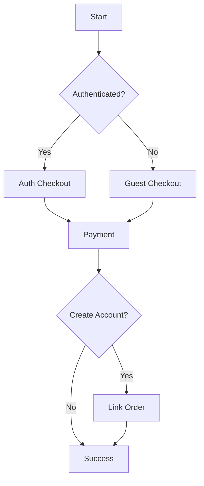

# Iteration 17: Guest/Auth Checkout Flow Plan

**Improvement over Iteration 16:** Added guest vs auth paths, emphasized Clerk integration, added account creation option.

## Objective
Guide SWE 1.6 to build checkout supporting both guest and authenticated users.

## How to Guide SWE 1.6

### Dual Path Commands
1. "Detect authentication status"
2. "Show guest checkout if not authenticated"
3. "Offer account creation after checkout"
4. "Link guest order to account on signup"

### Use Clerk Integration
Leverage existing Clerk setup.

## Dual Path Process

### Step 1: Auth Detection (Day 1)
**Command:** "Create auth detection component using Clerk"

**SWE 1.6 actions:**
1. Detect auth status
2. Show appropriate checkout path
3. Add login option for guests
4. Test both paths

### Step 2: Guest Checkout (Day 1-2)
**Command:** "Implement guest checkout flow"

**SWE 1.6 actions:**
1. Create guest checkout
2. Use email for identification
3. Save to reservation
4. Test guest flow

### Step 3: Auth Checkout (Day 2)
**Command:** "Implement authenticated checkout flow"

**SWE 1.6 actions:**
1. Create auth checkout
2. Use user data from Clerk
3. Pre-fill forms
4. Test auth flow

### Step 4: Account Creation (Day 2-3)
**Command:** "Add account creation option after guest checkout"

**SWE 1.6 actions:**
1. Add signup form on success
2. Link guest order to account
3. Transfer reservation
4. Test account creation

### Step 5: Payment & Success (Day 3-4)
**Command:** "Complete payment flow for both paths"

**SWE 1.6 actions:**
1. Add payment for guest
2. Add payment for auth
3. Create success page
4. Run E2E tests for both paths

## Success Criteria
- Guest checkout works
- Auth checkout works
- Account creation links orders
- E2E tests pass for both paths

## Diagram

## Verification
- Test guest path
- Test auth path
- Test account creation
- Final: `npm run test:checkout`
