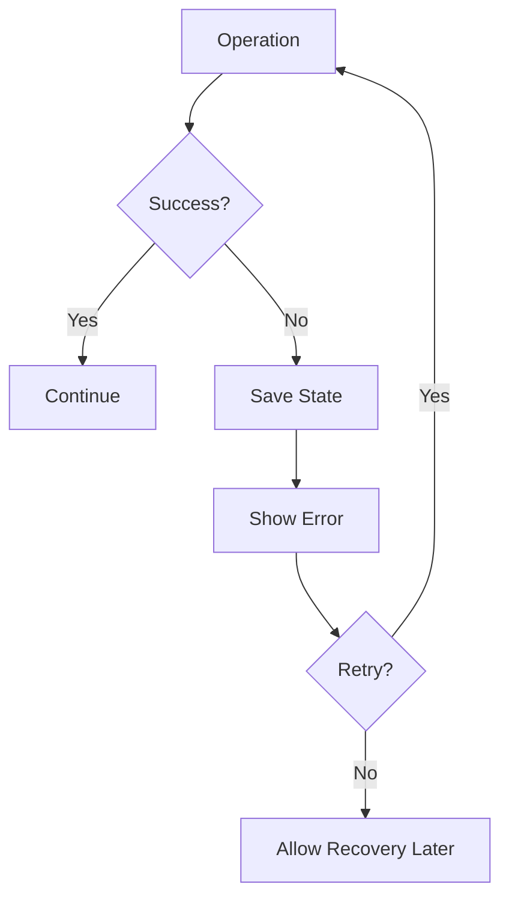

# Iteration 18: Error Recovery Checkout Flow Plan

**Improvement over Iteration 17:** Added comprehensive error recovery, emphasized resilience, added retry mechanisms.

## Objective
Guide SWE 1.6 to build checkout with robust error recovery.

## How to Guide SWE 1.6

### Error Recovery Commands
1. "Add error boundaries"
2. "Implement retry logic"
3. "Save state for recovery"
4. "Show helpful error messages"

### Never Lose Progress
Save state at each step for recovery.

## Error Recovery Process

### Step 1: Error Boundaries (Day 1)
**Command:** "Add error boundaries to checkout flow"

**SWE 1.6 actions:**
1. Add React error boundary
2. Add fallback UI
3. Log errors
4. Test error scenarios

### Step 2: State Persistence (Day 1-2)
**Command:** "Persist checkout state to session storage"

**SWE 1.6 actions:**
1. Save state after each step
2. Load state on page load
3. Clear state on completion
4. Test persistence

### Step 3: Retry Logic (Day 2)
**Command:** "Add retry logic for failed operations"

**SWE 1.6 actions:**
1. Add retry for API calls
2. Add exponential backoff
3. Show retry UI
4. Test retry scenarios

### Step 4: Reservation Recovery (Day 2-3)
**Command:** "Add reservation recovery on page load"

**SWE 1.6 actions:**
1. Check for existing reservation
2. Resume from last step
3. Show recovery message
4. Test recovery

### Step 5: Payment Recovery (Day 3)
**Command:** "Add payment error recovery"

**SWE 1.6 actions:**
1. Handle payment failures
2. Allow retry payment
3. Preserve reservation
4. Test payment errors

### Step 6: Checkout Flow (Day 3-4)
**Command:** "Complete checkout flow with error recovery"

**SWE 1.6 actions:**
1. Integrate all error recovery
2. Add helpful error messages
3. Test all error scenarios
4. Run E2E test

## Success Criteria
- Errors don't lose progress
- Retry works correctly
- E2E test passes: `npm run test:checkout`

## Diagram

## Verification
- Test each error scenario
- Test state recovery
- Final: `npm run test:checkout`
