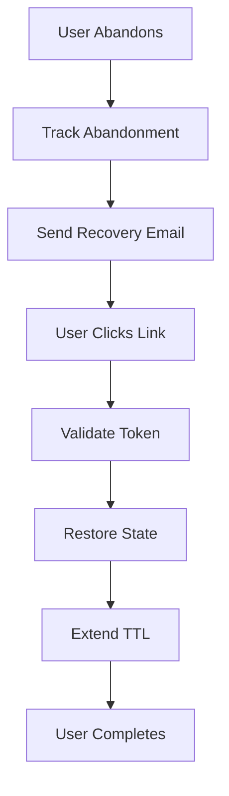

# Iteration 19: Abandoned Checkout Recovery Plan

**Improvement over Iteration 18:** Added abandoned checkout recovery, emphasized email recovery, added reservation TTL extension.

## Objective
Guide SWE 1.6 to build checkout with abandoned checkout recovery.

## How to Guide SWE 1.6

### Abandoned Recovery Commands
1. "Track abandoned checkouts"
2. "Send recovery emails"
3. "Extend reservation TTL on recovery"
4. "Show recovery link in email"

### Recover Lost Sales
Bring users back to complete checkout.

## Abandoned Recovery Process

### Step 1: Abandoned Tracking (Day 1)
**Command:** "Track abandoned checkouts in Sanity"

**SWE 1.6 actions:**
1. Add abandoned flag to reservation
2. Track last activity
3. Query abandoned reservations
4. Test tracking

### Step 2: Email Recovery (Day 1-2)
**Command:** "Add email recovery system"

**SWE 1.6 actions:**
1. Create email template
2. Add recovery link with token
3. Send email on abandonment
4. Test email sending

### Step 3: Recovery Link (Day 2)
**Command:** "Create recovery endpoint"

**SWE 1.6 actions:**
1. Create recovery route
2. Validate token
3. Restore checkout state
4. Extend reservation TTL
5. Test recovery

### Step 4: Recovery UI (Day 2-3)
**Command:** "Show recovery message on checkout page"

**SWE 1.6 actions:**
1. Detect recovery from email
2. Show recovery message
3. Restore state
4. Test recovery UI

### Step 5: TTL Extension (Day 3)
**Command:** "Extend reservation TTL on recovery"

**SWE 1.6 actions:**
1. Extend TTL on email open
2. Extend TTL on page visit
3. Update Sanity document
4. Test TTL extension

### Step 6: Complete Checkout (Day 3-4)
**Command:** "Complete checkout flow with abandoned recovery"

**SWE 1.6 actions:**
1. Integrate all recovery features
2. Test abandonment scenarios
3. Test recovery scenarios
4. Run E2E test

## Success Criteria
- Abandoned checkouts tracked
- Recovery emails sent
- Recovery links work
- E2E test passes: `npm run test:checkout`

## Diagram

## Verification
- Test abandonment detection
- Test email recovery
- Test TTL extension
- Final: `npm run test:checkout`
