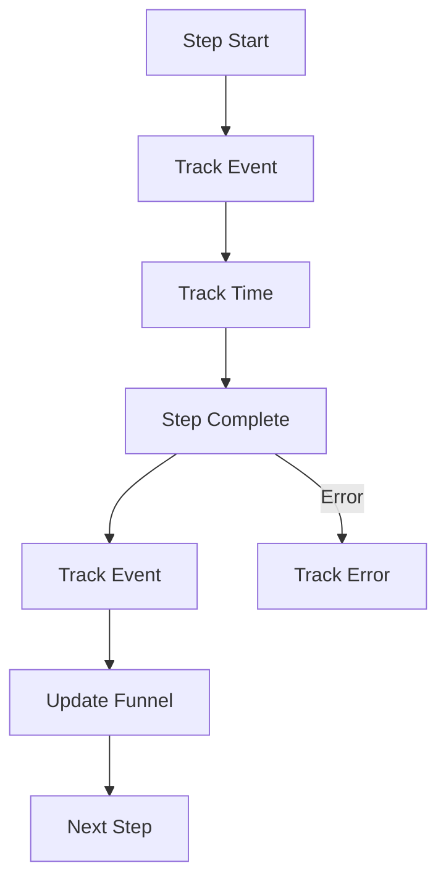

# Iteration 20: Analytics-Enhanced Checkout Flow Plan

**Improvement over Iteration 19:** Added analytics tracking, emphasized conversion funnel optimization, added drop-off tracking.

## Objective
Guide SWE 1.6 to build checkout with comprehensive analytics.

## How to Guide SWE 1.6

### Analytics Commands
1. "Track each checkout step"
2. "Measure time per step"
3. "Track drop-offs"
4. "Send events to analytics"

### Measure Everything
Track to optimize conversion funnel.

## Analytics Process

### Step 1: Event Tracking (Day 1)
**Command:** "Add event tracking to checkout steps"

**SWE 1.6 actions:**
1. Create analytics client
2. Track step starts
3. Track step completions
4. Track errors
5. Test tracking

### Step 2: Funnel Tracking (Day 1-2)
**Command:** "Track conversion funnel"

**SWE 1.6 actions:**
1. Track funnel entry
2. Track each step progression
3. Track completion
4. Calculate drop-off rates
5. Test funnel tracking

### Step 3: Time Tracking (Day 2)
**Command:** "Track time spent per step"

**SWE 1.6 actions:**
1. Track step start time
2. Track step end time
3. Calculate duration
4. Identify slow steps
5. Test time tracking

### Step 4: Error Tracking (Day 2-3)
**Command:** "Track errors with context"

**SWE 1.6 actions:**
1. Track error types
2. Track error frequency
3. Track error impact
4. Add error context
5. Test error tracking

### Step 5: Analytics Dashboard (Day 3)
**Command:** "Create analytics dashboard query"

**SWE 1.6 actions:**
1. Create Sanity query for analytics
2. Create dashboard view
3. Show funnel metrics
4. Show drop-off points
5. Test dashboard

### Step 6: Complete Checkout (Day 3-4)
**Command:** "Complete checkout flow with analytics"

**SWE 1.6 actions:**
1. Integrate all analytics
2. Verify all events tracked
3. Test analytics accuracy
4. Run E2E test

## Success Criteria
- All steps tracked
- Funnel metrics accurate
- Drop-offs identified
- E2E test passes: `npm run test:checkout`

## Diagram

## Verification
- Verify event tracking
- Verify funnel accuracy
- Final: `npm run test:checkout`
