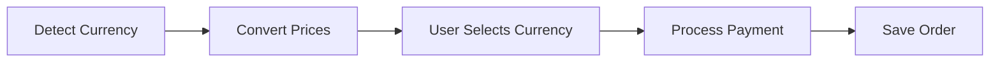

# Iteration 21: Multi-Currency Checkout Flow Plan

**Improvement over Iteration 20:** Added multi-currency support, emphasized currency detection, added price conversion.

## Objective
Guide SWE 1.6 to build checkout with multi-currency support.

## How to Guide SWE 1.6

### Multi-Currency Commands
1. "Detect user currency"
2. "Convert prices to local currency"
3. "Process payment in local currency"
4. "Display currency selector"

### Support Global Users
Allow checkout in user's currency.

## Multi-Currency Process

### Step 1: Currency Detection (Day 1)
**Command:** "Add currency detection based on location"

**SWE 1.6 actions:**
1. Detect user location
2. Map to currency
3. Save currency to session
4. Test detection

### Step 2: Price Conversion (Day 1-2)
**Command:** "Add price conversion to local currency"

**SWE 1.6 actions:**
1. Get exchange rates
2. Convert product prices
3. Convert shipping rates
4. Display in local currency
5. Test conversion

### Step 3: Currency Selector (Day 2)
**Command:** "Add currency selector UI"

**SWE 1.6 actions:**
1. Create currency selector
2. Update prices on change
3. Save preference
4. Test selector

### Step 4: Payment Processing (Day 2-3)
**Command:** "Process payment in selected currency"

**SWE 1.6 actions:**
1. Create Stripe payment intent in local currency
2. Process payment
3. Record currency in order
4. Test payment in different currencies

### Step 5: Order Display (Day 3)
**Command:** "Display order in original currency"

**SWE 1.6 actions:**
1. Save currency to order
2. Display in original currency
3. Show conversion if needed
4. Test order display

### Step 6: Complete Checkout (Day 3-4)
**Command:** "Complete checkout flow with multi-currency"

**SWE 1.6 actions:**
1. Integrate multi-currency
2. Test all currencies
3. Verify conversions
4. Run E2E test

## Success Criteria
- Currency detected correctly
- Prices converted accurately
- Payment processes in local currency
- E2E test passes: `npm run test:checkout`

## Diagram

## Verification
- Test currency detection
- Test price conversion
- Test payment in different currencies
- Final: `npm run test:checkout`
