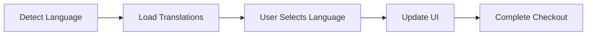

# Iteration 22: Multi-Language Checkout Flow Plan

**Improvement over Iteration 21:** Added multi-language support, emphasized i18n, added translated checkout.

## Objective
Guide SWE 1.6 to build checkout with multi-language support.

## How to Guide SWE 1.6

### Multi-Language Commands
1. "Set up i18n framework"
2. "Translate checkout UI"
3. "Detect user language"
4. "Add language selector"

### Support Global Users
Allow checkout in user's language.

## Multi-Language Process

### Step 1: i18n Setup (Day 1)
**Command:** "Set up next-intl for internationalization"

**SWE 1.6 actions:**
1. Install next-intl
2. Configure locales
3. Set up translation files
4. Test setup

### Step 2: Language Detection (Day 1-2)
**Command:** "Add language detection based on browser"

**SWE 1.6 actions:**
1. Detect browser language
2. Match to supported locale
3. Save to session
4. Test detection

### Step 3: Translate UI (Day 2)
**Command:** "Translate all checkout UI text"

**SWE 1.6 actions:**
1. Translate form labels
2. Translate error messages
3. Translate button text
4. Translate success messages
5. Test translations

### Step 4: Language Selector (Day 2-3)
**Command:** "Add language selector UI"

**SWE 1.6 actions:**
1. Create language selector
2. Update language on change
3. Save preference
4. Test selector

### Step 5: Translated Validation (Day 3)
**Command:** "Translate validation messages"

**SWE 1.6 actions:**
1. Translate address validation errors
2. Translate payment errors
3. Translate shipping errors
4. Test translated errors

### Step 6: Complete Checkout (Day 3-4)
**Command:** "Complete checkout flow with multi-language"

**SWE 1.6 actions:**
1. Integrate i18n
2. Test all languages
3. Verify translations
4. Run E2E test

## Success Criteria
- Language detected correctly
- All text translated
- Validation messages translated
- E2E test passes: `npm run test:checkout`

## Diagram

## Verification
- Test language detection
- Test translations
- Test language switcher
- Final: `npm run test:checkout`
