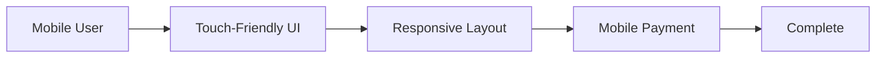

# Iteration 23: Mobile-Optimized Checkout Flow Plan

**Improvement over Iteration 22:** Added mobile optimization, emphasized touch-friendly UI, added responsive design.

## Objective
Guide SWE 1.6 to build checkout optimized for mobile devices.

## How to Guide SWE 1.6

### Mobile Commands
1. "Make forms touch-friendly"
2. "Optimize for small screens"
3. "Add mobile-specific features"
4. "Test on mobile devices"

### Mobile-First Design
Optimize for mobile, then desktop.

## Mobile Optimization Process

### Step 1: Touch-Friendly Forms (Day 1)
**Command:** "Make checkout forms touch-friendly"

**SWE 1.6 actions:**
1. Increase tap targets
2. Add input modes
3. Optimize keyboard
4. Test on mobile

### Step 2: Responsive Layout (Day 1-2)
**Command:** "Create responsive checkout layout"

**SWE 1.6 actions:**
1. Use mobile-first CSS
2. Stack elements on mobile
3. Optimize spacing
4. Test on different screen sizes

### Step 3: Mobile Address Input (Day 2)
**Command:** "Optimize address input for mobile"

**SWE 1.6 actions:**
1. Use mobile address autocomplete
2. Optimize Google Places for mobile
3. Add touch-friendly selection
4. Test on mobile

### Step 4: Mobile Payment (Day 2-3)
**Command:** "Optimize payment for mobile"

**SWE 1.6 actions:1. Optimize Stripe Elements for mobile
2. Add mobile payment methods
3. Optimize keyboard handling
4. Test on mobile

### Step 5: Mobile-Specific Features (Day 3)
**Command:** "Add mobile-specific features"

**SWE 1.6 actions:**
1. Add swipe gestures
2. Add haptic feedback
3. Optimize loading states
4. Test features

### Step 6: Complete Checkout (Day 3-4)
**Command:** "Complete checkout flow with mobile optimization"

**SWE 1.6 actions:**
1. Integrate mobile optimizations
2. Test on mobile devices
3. Test on desktop
4. Run E2E test on mobile

## Success Criteria
- Touch targets large enough
- Forms work on mobile
- Payment works on mobile
- E2E test passes on mobile: `npm run test:e2e:iphone`

## Diagram

## Verification
- Test on iPhone
- Test on Android
- Final: `npm run test:e2e:iphone`
