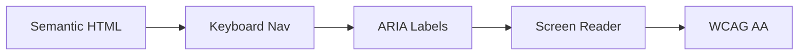

# Iteration 24: Accessibility-First Checkout Flow Plan

**Improvement over Iteration 23:** Added accessibility focus, emphasized WCAG compliance, added screen reader support.

## Objective
Guide SWE 1.6 to build checkout with full accessibility.

## How to Guide SWE 1.6

### Accessibility Commands
1. "Add ARIA labels"
2. "Ensure keyboard navigation"
3. "Add screen reader support"
4. "Test with accessibility tools"

### WCAG Compliance
Meet WCAG 2.1 AA standards.

## Accessibility Process

### Step 1: Semantic HTML (Day 1)
**Command:** "Use semantic HTML for checkout forms"

**SWE 1.6 actions:**
1. Use proper form labels
2. Use semantic elements
3. Add proper headings
4. Test with screen reader

### Step 2: Keyboard Navigation (Day 1-2)
**Command:** "Ensure full keyboard navigation"

**SWE 1.6 actions:**
1. Add tab order
2. Add keyboard shortcuts
3. Add focus indicators
4. Test keyboard navigation

### Step 3: ARIA Labels (Day 2)
**Command:** "Add ARIA labels to all interactive elements"

**SWE 1.6 actions:**
1. Add aria-labels
2. Add aria-describedby
3. Add live regions for errors
4. Test with screen reader

### Step 4: Screen Reader Support (Day 2-3)
**Command:** "Optimize for screen readers"

**SWE 1.6 actions:
1. Test with NVDA
2. Test with VoiceOver
3. Fix screen reader issues
4. Verify all content accessible

### Step 5: Color Contrast (Day 3)
**Command:** "Ensure color contrast meets WCAG AA"

**SWE 1.6 actions:
1. Check color contrast
2. Fix contrast issues
3. Test with color blindness simulators
4. Verify accessibility

### Step 6: Complete Checkout (Day 3-4)
**Command:** "Complete checkout flow with full accessibility"

**SWE 1.6 actions:
1. Integrate all accessibility features
2. Run accessibility audit
3. Fix all issues
4. Run E2E test with accessibility tools

## Success Criteria
- Keyboard navigation works
- Screen reader works
- Color contrast compliant
- E2E test passes: `npm run test:checkout:a11y`

## Diagram

## Verification
- Test with keyboard only
- Test with screen reader
- Run axe-core audit
- Final: `npm run test:checkout:a11y`
