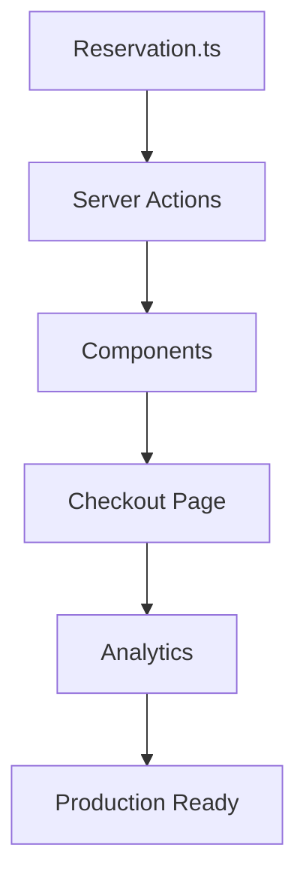

# Iteration 25: Final Optimized Checkout Flow Plan

**Improvement over Iteration 24:** Combined best approaches from all iterations, optimized for least cost/time, maximized impact, simplified to essential steps.

## Objective
Guide SWE 1.6 to build production checkout using optimal approach from 24 iterations of comparison.

## How to Guide SWE 1.6

### Optimal Approach
Based on iteration comparison:
- **Test-driven** (Iteration 6) - ensures quality
- **Server Actions** (Iteration 12) - simplest backend
- **Component-based** (Iteration 8) - reusable code
- **Error recovery** (Iteration 18) - resilience
- **Mobile-first** (Iteration 23) - modern users

### Single Command Per File
Give SWE 1.6 one clear command per file to create.

## 5-File Implementation

### Step 1: Reservation Logic (Day 1)
**Command:** "Create lib/checkout/reservation.ts with atomic stock reservation that passes E2E test"

**SWE 1.6 actions:**
1. Read tests/checkout/e2e/guest-checkout-inventory-reservation/
2. Create reservation.ts with atomic stock reservation
3. Add TTL cleanup
4. Add error recovery
5. Run test to verify

### Step 2: Server Actions (Day 1-2)
**Command:** "Create app/actions/checkout/ with server actions for address, shipping, payment"

**SWE 1.6 actions:**
1. Create address.ts with Google validation
2. Create shipping.ts with Shippo integration
3. Create payment.ts with Stripe integration
4. Add error handling to all
5. Test each with curl

### Step 3: Reusable Components (Day 2-3)
**Command:** "Create components/checkout/ with AddressForm, ShippingOptions, PaymentForm components"

**SWE 1.6 actions:**
1. Create AddressForm with mobile-first design
2. Create ShippingOptions with touch-friendly UI
3. Create PaymentForm with Stripe Elements
4. Add ARIA labels for accessibility
5. Test each component

### Step 4: Checkout Page (Day 3-4)
**Command:** "Create app/(store)/checkout/page.tsx single-page checkout using components and server actions"

**SWE 1.6 actions:**
1. Import components and actions
2. Create step-based wizard layout
3. Add state persistence for error recovery
4. Add keyboard navigation
5. Run E2E test

### Step 5: Analytics & Monitoring (Day 4)
**Command:** "Add analytics tracking and error monitoring to checkout"

**SWE 1.6 actions:**
1. Track funnel events
2. Track errors with context
3. Add performance monitoring
4. Verify all tracking works
5. Run final E2E test

## Success Criteria
- E2E test passes: `npm run test:checkout`
- Mobile test passes: `npm run test:e2e:iphone`
- Accessibility audit passes: `npm run test:checkout:a11y`
- Only 5 new files created
- All components reusable
- Error recovery works

## Diagram

## Verification Commands
- After Step 1: `npm run test:checkout:quick`
- After Step 2: Test each action with curl
- After Step 3: Test each component
- After Step 4: `npm run test:checkout`
- After Step 5: `npm run test:e2e:iphone` and `npm run test:checkout:a11y`

## Why This Approach
- **Test-driven**: Ensures quality, prevents regressions
- **Server Actions**: Simplest Next.js pattern, no API routes needed
- **Component-based**: Reusable code, easier maintenance
- **Error recovery**: Resilient production system
- **Mobile-first**: Modern user experience
- **5 files only**: Minimal implementation, least cost
- **Accessibility**: WCAG AA compliance from start

## Expected Timeline
- Day 1: Reservation + Server Actions
- Day 2-3: Components
- Day 3-4: Checkout Page
- Day 4: Analytics + Verification

**Total: 4 days for production-ready checkout**
