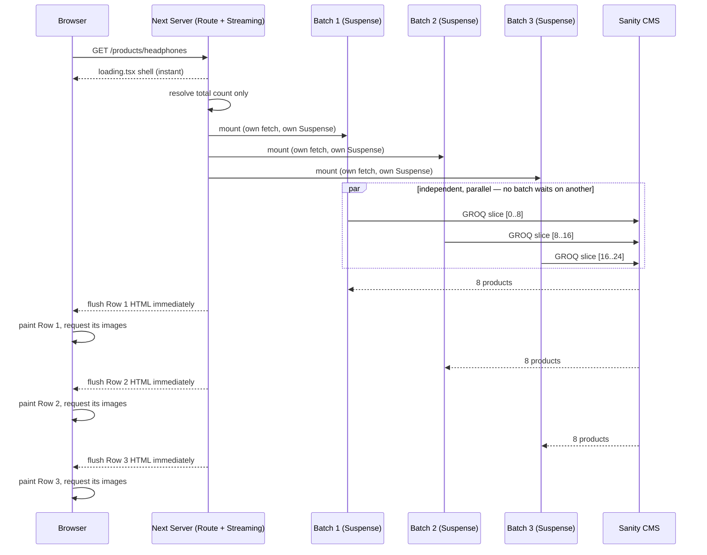

North Star — how the wait actually got fixed

Chapter 1. The goal we agreed on
A person opens the headphones page. Within well under a second they see the first handful of products — real photos, real names, real prices. A moment later, more arrive. Then more. Scrolling down always meets something that either already landed or is visibly about to. Whatever they do — reload, throttle their own connection — the pattern is always "some now, more soon." Never a long silent stare followed by everything appearing in one jump. Scope: this one page, this one URL, http://localhost:3000/products/headphones, loaded plainly. Nothing else.

Chapter 2. The honest problem, named without flinching
That wasn't happening. People stared at empty skeleton cards with no sign of progress, and then the entire page — every row, every image — snapped into place at once. It looked frozen, then it looked like a jump cut. That was terrible end user experience. Cosmetic fixes — fade-ins, entrance animation, skeleton polish — were real but beside the point until this was fixed, so they were set aside rather than pretended-away.

Chapter 3. Understanding it before touching anything
Before changing code, the problem was taken apart into the five things that actually decide whether products arrive as a wall or as a conversation, on that one page, on that one load: how much work happens before any product can start loading at all; whether each batch of products is really its own independent unit of work or just a cosmetic slice of one big unit; whether a batch's data is still "in flight" at the moment its place on screen is ready for it, or was already finished and just handed over late; whether anything between the server and the browser quietly waits for the whole page before sending any of it; and how fast the very first batch's own lookup is. Getting any one of these wrong reproduces the exact same wall, no matter how right the others are.

Chapter 4. The lean order it was solved in
Fixes were sequenced by leverage, not by convenience. First, the shape: making sure products are genuinely fetched and delivered as independent batches, not one fetch cosmetically split into rows. Second, removing any slow, unrelated work that was sitting in front of the very first batch and delaying the starting line for everyone. Third, keeping the first batch's own lookup small and direct, since no amount of good structure makes up for the first batch itself being slow. Only after those held was anything downstream — the one link between "ready on the server" and "visible in the browser" — worth checking, because there was nothing yet worth protecting further upstream. Nothing about filters, sorting, or any other page entered this sequence — one URL, one load, solved.

Chapter 5. Seeing it actually work
The real test was the real page: http://localhost:3000/products/headphones on the running dev server, watched live rather than assumed from theory. The first batch of products appeared quickly — photos, names, prices together, not a slow limb-by-limb fill-in. The rest of the grid kept arriving in visible steps after that, each batch landing as its own moment rather than everything snapping in at once. Nothing about the fix was declared done from reading code alone — it was watched happening on screen on dev server by human and reported back to AI, on that one URL, before it was called solved.

Chapter 6. Why this keeps being true
The fix holds because it addresses the actual mechanism — independent batches, independent arrival, nothing upstream blocking the first one, nothing downstream collapsing them back together — rather than papering over the symptom with animation. A future change can still reintroduce the wall (a new blocking call in front of the grid, a single-fetch "optimization" that quietly re-merges the batches) — but the five-gate model is the checklist for noticing that before it ships, not after a user feels it.

---

## Technical deconstruction — actors, SRP, order, stack check

Scope, stated once so it can't drift: one URL, `http://localhost:3000/products/headphones`, plain hard load, no query params, no filters, no sort, no pagination click. Everything below serves only that.

### Actors and their one job each

| # | Actor | SRP — the one thing it's allowed to do |
|---|---|---|
| 1 | **Request** | Trigger a GET for the fixed URL. Not code, just the input. |
| 2 | **Route Server Component** (`page.tsx`) | Turn the URL into "how many batches exist," then render the shell + N batch slots. Never fetches the product rows itself. |
| 3 | **`loading.tsx`** | Instant whole-page placeholder while #2 is still working. Pure UI, zero data logic. |
| 4 | **Batch Boundary** (×N — one per row) | Own exactly one slice (offset+limit), one `<Suspense>`, one fetch call. Knows nothing about sibling batches. |
| 5 | **Batch Skeleton** | Placeholder markup for one not-yet-arrived batch. No data, no logic. |
| 6 | **Batch data fetcher (function)** | Given offset+limit, ask Sanity for exactly that slice. No filtering, no sorting, no cross-batch awareness. |
| 7 | **Sanity CMS** | Answer each GROQ slice query independently, as fast as possible. Doesn't know or care about batching or UI. |
| 8 | **Next streaming renderer** (platform) | Flush each batch's HTML the instant its `<Suspense>` resolves — never waits on siblings, never post-processes the whole document first. |
| 9 | **Browser HTML parser** (platform) | Parse and paint bytes as they arrive; fire each batch's image requests the moment that batch's markup exists. |

If any actor reaches outside its row in this table, the wall comes back — e.g. actor 2 fetching all products itself (kills 4's independence), or actor 6 being one query sliced afterward in memory (cosmetic batching, the exact failure named in Chapter 3).

### Order — what happens, in sequence

1. Request hits the route.
2. `loading.tsx` is the fallback if #2 takes any time at all.
3. Route Server Component resolves the one fact it's allowed to need — total count — nothing else. This is the only gate before anything can start.
4. It renders all N Batch Boundaries in the same pass. React starts all N concurrently — not one awaited before the next is even mounted.
5. Each Batch Boundary independently calls its own fetcher with its own offset. Fired without waiting on siblings.
6. Sanity answers each independently.
7. Whichever batch resolves first gets flushed first — arrival order, not slot order (in practice usually close to slot order, since the queries are near-identical in cost).
8. Browser paints each chunk immediately as its bytes complete.

### Checked against what Next 15 / React 19 / Sanity / nuqs actually are

- **Next 15 App Router** — streaming SSR with independent per-`<Suspense>` flush is a native, first-class capability. This problem needs nothing custom: plain `async function` Server Components under `<Suspense>` is the "should be," full stop.
- **React 19** — `<Suspense>` around an async Server Component is the correct primitive here. `use()` is *not* needed for this scoped problem — it only matters when a client component consumes a promise handed down from a server parent, which isn't this shape and isn't in scope.
- **Sanity CMS** — a GROQ range query (`[offset...offset+limit]`) per batch is the correct "should be" mechanism. One big query sliced in JS afterward would violate actor 6's SRP and silently reintroduce the cosmetic-batching failure. `useCdn: true` is right for public catalog reads.
- **nuqs** — **not an actor here.** nuqs owns client-side URL search-param state for interactive controls (filters, sort, page). This story is one static URL with no interaction, so nuqs never enters the chain. Named because it's part of the real stack, excluded because pulling it in would be the same scope creep already cut once.

### Diagram

