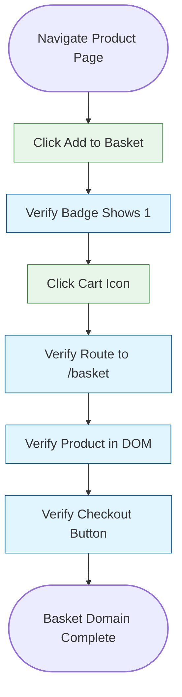

```mermaid
graph TD
    classDef large font-size:20px,padding:15px,stroke-width:2px;
    classDef logic fill:#fff4dd,stroke:#d4a017,font-size:20px;
    classDef state fill:#e1f5fe,stroke:#01579b,font-size:20px;
    classDef action fill:#e8f5e9,stroke:#2e7d32,font-size:20px;

    Start([Navigate Product Page]):::large --> AddBasket[Click Add to Basket]:::action
    
    AddBasket --> VerifyBadge[Verify Badge Shows 1]:::state
    
    VerifyBadge --> ClickIcon[Click Cart Icon]:::action
    
    ClickIcon --> VerifyRoute[Verify Route to /basket]:::state
    
    VerifyRoute --> VerifyRender[Verify Product in DOM]:::state
    
    VerifyRender --> VerifyButton[Verify Checkout Button]:::state
    
    VerifyButton --> Finish([Basket Domain Complete]):::large
```
