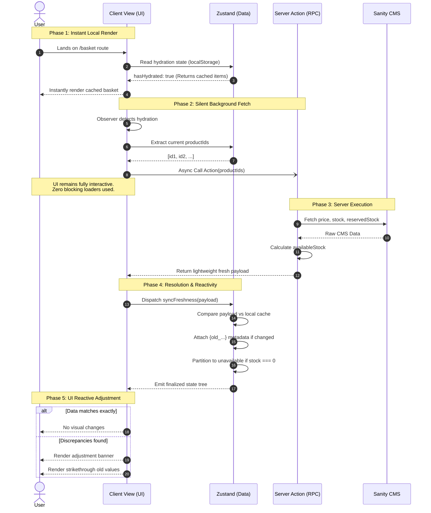

```mermaid
sequenceDiagram
    autonumber
    actor User
    participant UI as Client View (UI)
    participant Store as Zustand (Data)
    participant Action as Server Action (RPC)
    participant CMS as Sanity CMS

    Note over User, UI: Phase 1: Instant Local Render
    User->>UI: Lands on /basket route
    UI->>Store: Read hydration state (localStorage)
    Store-->>UI: hasHydrated: true (Returns cached items)
    UI-->>User: Instantly render cached basket

    Note over UI, Action: Phase 2: Silent Background Fetch
    UI->>UI: Observer detects hydration
    UI->>Store: Extract current productIds
    Store-->>UI: [id1, id2, ...]
    UI-)Action: Async Call Action(productIds)
    Note over UI, User: UI remains fully interactive.<br/>Zero blocking loaders used.

    Note over Action, CMS: Phase 3: Server Execution
    Action->>CMS: Fetch price, stock, reservedStock
    CMS-->>Action: Raw CMS Data
    Action->>Action: Calculate availableStock
    Action-->>UI: Return lightweight fresh payload

    Note over UI, Store: Phase 4: Resolution & Reactivity
    UI->>Store: Dispatch syncFreshness(payload)
    Store->>Store: Compare payload vs local cache
    Store->>Store: Attach {old_...} metadata if changed
    Store->>Store: Partition to unavailable if stock === 0
    Store-->>UI: Emit finalized state tree

    Note over UI, User: Phase 5: UI Reactive Adjustment
    alt Data matches exactly
        UI-->>User: No visual changes
    else Discrepancies found
        UI-->>User: Render adjustment banner
        UI-->>User: Render strikethrough old values
    end
```