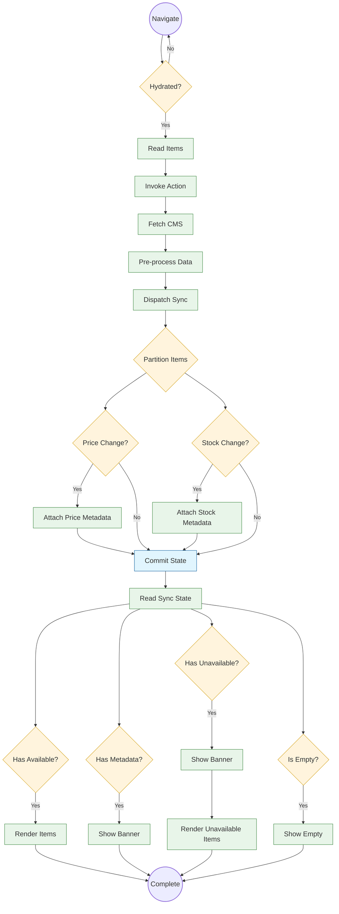

```mermaid
graph TD
    classDef large font-size:20px,padding:15px,stroke-width:2px;
    classDef logic fill:#fff4dd,stroke:#d4a017,font-size:20px;
    classDef state fill:#e1f5fe,stroke:#01579b,font-size:20px;
    classDef action fill:#e8f5e9,stroke:#2e7d32,font-size:20px;

    Start((Navigate)):::large --> CheckHydration{Hydrated?}:::logic
    CheckHydration -->|Yes| ReadItems[Read Items]:::action
    CheckHydration -->|No| Start

    ReadItems --> InvokeAction[Invoke Action]:::action
    InvokeAction --> FetchCMS[Fetch CMS]:::action
    FetchCMS --> PreProcess[Pre-process Data]:::action
    PreProcess --> DispatchSync[Dispatch Sync]:::action

    DispatchSync --> Partition{Partition Items}:::logic
    Partition --> DetectPrice{Price Change?}:::logic
    Partition --> DetectStock{Stock Change?}:::logic

    DetectPrice -->|Yes| AttachPrice[Attach Price Metadata]:::action
    DetectPrice -->|No| CommitState[Commit State]:::state
    DetectStock -->|Yes| AttachStock[Attach Stock Metadata]:::action
    DetectStock -->|No| CommitState

    AttachPrice --> CommitState
    AttachStock --> CommitState

    CommitState --> ReadSync[Read Sync State]:::action
    ReadSync --> HasAvailable{Has Available?}:::logic
    ReadSync --> HasMetadata{Has Metadata?}:::logic
    ReadSync --> HasUnavailable{Has Unavailable?}:::logic
    ReadSync --> IsEmpty{Is Empty?}:::logic

    HasAvailable -->|Yes| RenderItems[Render Items]:::action
    HasMetadata -->|Yes| ShowBanner[Show Banner]:::action
    HasUnavailable -->|Yes| ShowUnavailable[Show Banner]:::action
    ShowUnavailable --> RenderUnavailable[Render Unavailable Items]:::action
    RenderUnavailable --> End
    IsEmpty -->|Yes| ShowEmpty[Show Empty]:::action

    RenderItems --> End((Complete)):::large
    ShowBanner --> End
    ShowEmpty --> End
```

