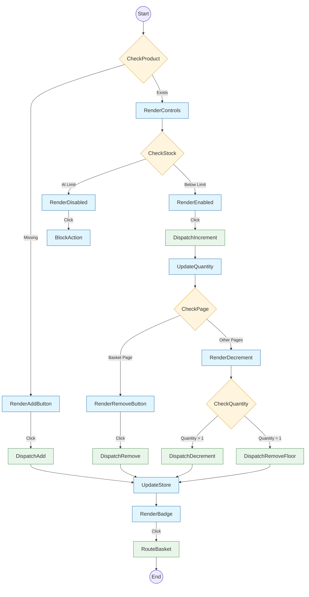

# Basket Controls Integration Test Diagram

```mermaid
graph TD
    classDef large font-size:20px,padding:15px,stroke-width:2px;
    classDef logic fill:#fff4dd,stroke:#d4a017,font-size:20px;
    classDef state fill:#e1f5fe,stroke:#01579b,font-size:20px;
    classDef action fill:#e8f5e9,stroke:#2e7d32,font-size:20px;

    Start((Start)):::large --> CheckProduct{CheckProduct}:::logic
    CheckProduct -->|Missing| RenderAddButton[RenderAddButton]:::state
    CheckProduct -->|Exists| RenderControls[RenderControls]:::state

    RenderAddButton -->|Click| DispatchAdd[DispatchAdd]:::action
    DispatchAdd --> UpdateStore[UpdateStore]:::state

    RenderControls --> CheckStock{CheckStock}:::logic
    CheckStock -->|Below Limit| RenderEnabled[RenderEnabled]:::state
    CheckStock -->|At Limit| RenderDisabled[RenderDisabled]:::state

    RenderEnabled -->|Click| DispatchIncrement[DispatchIncrement]:::action
    DispatchIncrement --> UpdateQuantity[UpdateQuantity]:::state

    RenderDisabled -->|Click| BlockAction[BlockAction]:::state

    UpdateQuantity --> CheckPageContext{CheckPage}:::logic
    CheckPageContext -->|Basket Page| RenderRemoveButton[RenderRemoveButton]:::state
    CheckPageContext -->|Other Pages| RenderDecrement[RenderDecrement]:::state

    RenderRemoveButton -->|Click| DispatchRemove[DispatchRemove]:::action
    DispatchRemove --> UpdateStore

    RenderDecrement --> CheckQuantity{CheckQuantity}:::logic
    CheckQuantity -->|Quantity > 1| DispatchDecrement[DispatchDecrement]:::action
    CheckQuantity -->|Quantity = 1| DispatchRemoveFloor[DispatchRemoveFloor]:::action

    DispatchDecrement --> UpdateStore
    DispatchRemoveFloor --> UpdateStore

    UpdateStore --> RenderBadge[RenderBadge]:::state
    RenderBadge -->|Click| RouteBasket[RouteBasket]:::action
    RouteBasket --> End((End)):::large
```
