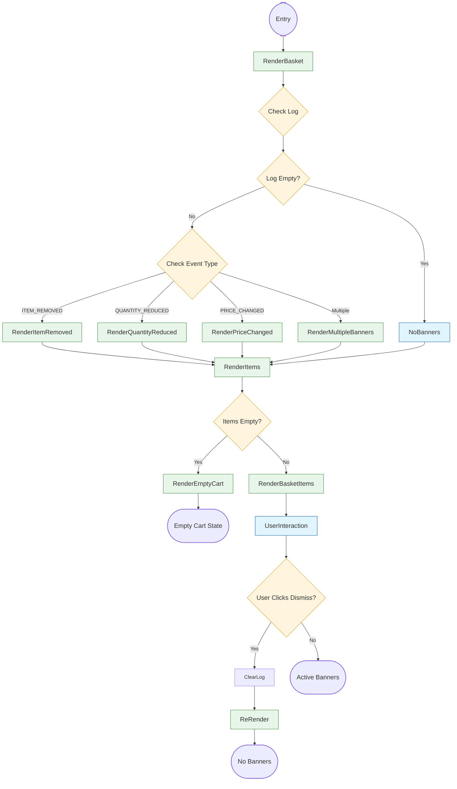

# Basket Lifecycle Reconciliation Diagram

```mermaid
graph TD
    Entry([Entry]) --> RenderBasket

    RenderBasket --> CheckLog{Check Log}
    CheckLog --> LogEmpty{Log Empty?}
    LogEmpty -->|Yes| NoBanners
    LogEmpty -->|No| CheckEventType{Check Event Type}

    CheckEventType -->|ITEM_REMOVED| RenderItemRemoved
    CheckEventType -->|QUANTITY_REDUCED| RenderQuantityReduced
    CheckEventType -->|PRICE_CHANGED| RenderPriceChanged
    CheckEventType -->|Multiple| RenderMultipleBanners

    RenderItemRemoved --> RenderItems
    RenderQuantityReduced --> RenderItems
    RenderPriceChanged --> RenderItems
    RenderMultipleBanners --> RenderItems

    NoBanners --> RenderItems
    RenderItems --> ItemsEmpty{Items Empty?}
    ItemsEmpty -->|Yes| RenderEmptyCart
    ItemsEmpty -->|No| RenderBasketItems

    RenderEmptyCart --> EmptyCartState([Empty Cart State])
    RenderBasketItems --> UserInteraction

    UserInteraction --> UserClicksDismiss{User Clicks Dismiss?}
    UserClicksDismiss -->|Yes| ClearLog
    UserClicksDismiss -->|No| ActiveBanners([Active Banners])

    ClearLog --> ReRender
    ReRender --> NoBannersTerminal([No Banners])

    classDef large font-size:20px,padding:15px,stroke-width:2px;
    classDef logic fill:#fff4dd,stroke:#d4a017,font-size:20px;
    classDef state fill:#e1f5fe,stroke:#01579b,font-size:20px;
    classDef action fill:#e8f5e9,stroke:#2e7d32,font-size:20px;

    class RenderBasket,RenderItemRemoved,RenderQuantityReduced,RenderPriceChanged,RenderMultipleBanners,RenderItems,RenderEmptyCart,RenderBasketItems,ReRender action;
    class CheckLog,LogEmpty,CheckEventType,ItemsEmpty,UserClicksDismiss logic;
    class NoBanners,UserInteraction state;
    class Entry,EmptyCartState,ActiveBanners,NoBannersTerminal large;
```
