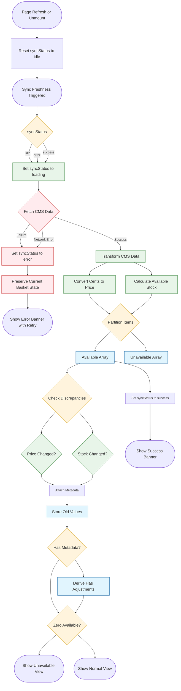

# Basket Latest Sync Flow

```mermaid
graph TD
  A([Sync Freshness Triggered]) --> B{syncStatus}
  B -->|idle| C[Set syncStatus to loading]
  B -->|error| C
  B -->|success| C

  C --> D{Fetch CMS Data}
  D -->|Success| E[Transform CMS Data]
  D -->|Failure| F[Set syncStatus to error]
  D -->|Network Error| F

  F --> G[Preserve Current Basket State]
  G --> H([Show Error Banner with Retry])

  E --> I[Convert Cents to Price]
  E --> J[Calculate Available Stock]
  I --> K{Partition Items}
  J --> K

  K --> L[Available Array]
  K --> M[Unavailable Array]

  L --> N{Check Discrepancies}
  N --> O{Price Changed?}
  N --> P{Stock Changed?}
  O --> Q[Attach Metadata]
  P --> Q

  Q --> R[Store Old Values]
  R --> S{Has Metadata?}
  S --> T[Derive Has Adjustments]
  S --> U{Zero Available?}

  T --> U
  U --> V([Show Unavailable View])
  U --> W([Show Normal View])

  L --> X[Set syncStatus to success]
  X --> Y([Show Success Banner])

  Z([Page Refresh or Unmount]) --> AA[Reset syncStatus to idle]
  AA --> A

  classDef large font-size:20px,padding:15px,stroke-width:2px;
  classDef logic fill:#fff4dd,stroke:#d4a017,font-size:20px;
  classDef state fill:#e1f5fe,stroke:#01579b,font-size:20px;
  classDef action fill:#e8f5e9,stroke:#2e7d32,font-size:20px;
  classDef error fill:#ffebee,stroke:#c62828,font-size:20px;

  class A,W,V,H,Y,Z,AA large;
  class B,K,N,S,U logic;
  class L,M,R,T state;
  class C,E,I,J,O,P action;
  class D,F,G error;
```
