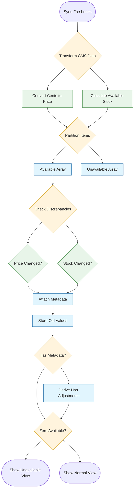

# Basket Latest Sync Flow

```mermaid
graph TD
  A([Sync Freshness]) --> B{Transform CMS Data}
  B --> C[Convert Cents to Price]
  B --> D[Calculate Available Stock]
  C --> E{Partition Items}
  D --> E
  E --> F[Available Array]
  E --> G[Unavailable Array]
  F --> H{Check Discrepancies}
  H --> I{Price Changed?}
  H --> J{Stock Changed?}
  I --> K[Attach Metadata]
  J --> K
  K --> L[Store Old Values]
  L --> M{Has Metadata?}
  M --> N[Derive Has Adjustments]
  M --> O{Zero Available?}
  N --> O
  O --> P([Show Unavailable View])
  O --> Q([Show Normal View])

  classDef large font-size:20px,padding:15px,stroke-width:2px;
  classDef logic fill:#fff4dd,stroke:#d4a017,font-size:20px;
  classDef state fill:#e1f5fe,stroke:#01579b,font-size:20px;
  classDef action fill:#e8f5e9,stroke:#2e7d32,font-size:20px;

  class A,Q,P large;
  class B,E,H,M,O logic;
  class F,G,K,L,N state;
  class C,D,I,J action;
```
