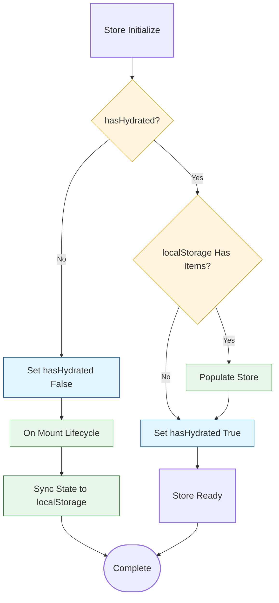

```mermaid
graph TD
    classDef large font-size:20px,padding:15px,stroke-width:2px;
    classDef logic fill:#fff4dd,stroke:#d4a017,font-size:20px;
    classDef state fill:#e1f5fe,stroke:#01579b,font-size:20px;
    classDef action fill:#e8f5e9,stroke:#2e7d32,font-size:20px;

    Start[Store Initialize]:::large --> Guard{hasHydrated?}:::logic
    
    Guard -->|No| SetFalse[Set hasHydrated False]:::state
    Guard -->|Yes| CheckLS{localStorage Has Items?}:::logic
    
    SetFalse --> Mount[On Mount Lifecycle]:::action
    CheckLS -->|Yes| Populate[Populate Store]:::action
    CheckLS -->|No| SetTrue[Set hasHydrated True]:::state
    
    Populate --> SetTrue
    SetTrue --> Ready[Store Ready]:::large
    
    Mount --> Sync[Sync State to localStorage]:::action
    Sync --> Finish([Complete]):::large
    Ready --> Finish
```
