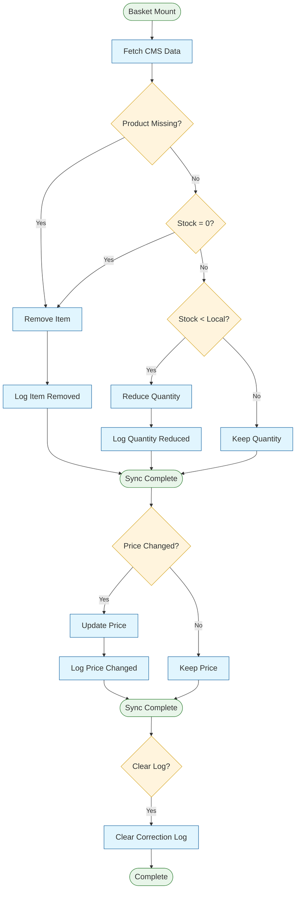

# Basket Reconciliation Lifecycle Diagram

```mermaid
graph TD
    A(["Basket Mount"]) --> B["Fetch CMS Data"]
    B --> C{"Product Missing?"}
    C -->|Yes| D["Remove Item"]
    D --> E["Log Item Removed"]
    E --> F(["Sync Complete"])

    C -->|No| G{"Stock = 0?"}
    G -->|Yes| D
    G -->|No| H{"Stock < Local?"}
    H -->|Yes| I["Reduce Quantity"]
    I --> J["Log Quantity Reduced"]
    J --> F
    H -->|No| K["Keep Quantity"]
    K --> F

    F --> L{"Price Changed?"}
    L -->|Yes| M["Update Price"]
    M --> N["Log Price Changed"]
    N --> O(["Sync Complete"])

    L -->|No| P["Keep Price"]
    P --> O

    O --> Q{"Clear Log?"}
    Q -->|Yes| R["Clear Correction Log"]
    R --> S(["Complete"])

    classDef large font-size:20px,padding:15px,stroke-width:2px;
    classDef logic fill:#fff4dd,stroke:#d4a017,font-size:20px;
    classDef state fill:#e1f5fe,stroke:#01579b,font-size:20px;
    classDef action fill:#e8f5e9,stroke:#2e7d32,font-size:20px;

    class C,G,H,L,Q logic;
    class A,F,O,S action;
    class B,D,E,I,J,K,M,N,P,R state;
```
