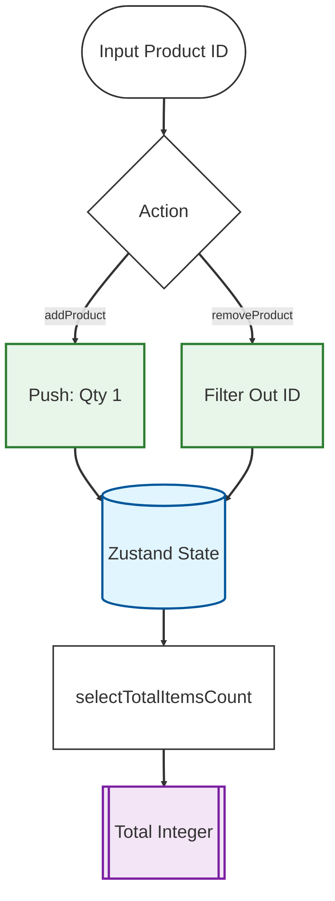

```mermaid
graph TD
    %% Global Styles & Class Definitions
    %% Increase font size to 24px for maximum readability.
    %% Use large padding to force bigger nodes.
    %% TD (Top-Down) prevents extreme horizontal scaling.
    %% linkStyle used to thicken connectors.
    %% NodeSpacing/RankSpacing settings are handled intrinsically by TD flow.
    
    classDef main fill:#fff,stroke:#333,stroke-width:2px,font-size:24px,padding:20px;
    classDef act fill:#e8f5e9,stroke:#2e7d32,stroke-width:3px,font-size:24px,padding:20px;
    classDef zustand fill:#e1f5fe,stroke:#01579b,stroke-width:3px,font-size:24px,padding:20px;
    classDef select fill:#f3e5f5,stroke:#7b1fa2,stroke-width:3px,font-size:24px,padding:20px;
    linkStyle default stroke-width:3px,fill:none;

    %% Node Definitions using simple labels
    A([Input Product ID]):::main
    B{Action}:::main
    C[Push: Qty 1]:::act
    D[Filter Out ID]:::act
    E[(Zustand State)]:::zustand
    F[selectTotalItemsCount]:::main
    G[[Total Integer]]:::select

    %% Simplified Flow & Connections
    %% TD prevents the renderer from cramping text width.
    A --> B
    
    B -- addProduct --> C
    B -- removeProduct --> D
    
    C --> E
    D --> E
    
    E --> F
    F --> G
```