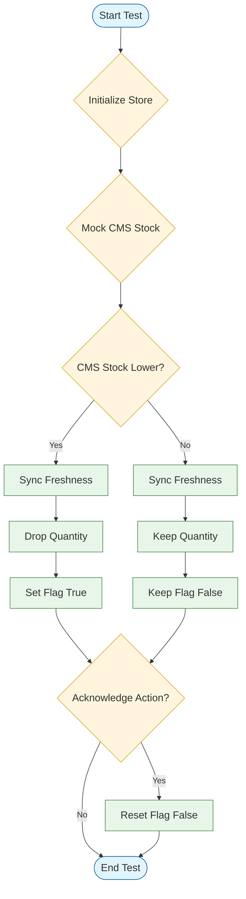

# Basket Store Freshness Test Diagram

```mermaid
graph TD
    A([Start Test]) --> B{Initialize Store}
    B --> C{Mock CMS Stock}
    C --> D{CMS Stock Lower?}
    D -->|Yes| E[Sync Freshness]
    E --> F[Drop Quantity]
    F --> G[Set Flag True]
    D -->|No| H[Sync Freshness]
    H --> I[Keep Quantity]
    I --> J[Keep Flag False]
    G --> K{Acknowledge Action?}
    J --> K
    K -->|Yes| L[Reset Flag False]
    K -->|No| M([End Test])
    L --> M

    classDef large font-size:20px,padding:15px,stroke-width:2px;
    classDef logic fill:#fff4dd,stroke:#d4a017,font-size:20px;
    classDef state fill:#e1f5fe,stroke:#01579b,font-size:20px;
    classDef action fill:#e8f5e9,stroke:#2e7d32,font-size:20px;

    class B,C,D,K logic;
    class E,H action;
    class A,M state;
    class F,G,I,J,L action;
```
