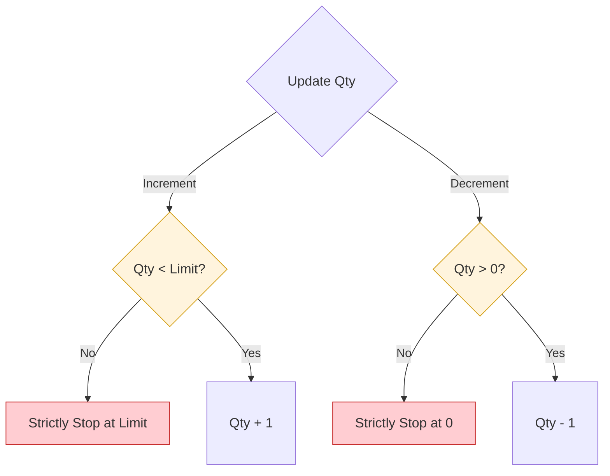

```mermaid
graph TD
    classDef large font-size:18px,padding:12px;
    classDef logic fill:#fff4dd,stroke:#d4a017,font-size:18px;
    classDef limit fill:#ffebee,stroke:#c62828,font-size:18px;

    Update{Update Qty}:::large
    
    Update -->|Increment| Stock{Qty < Limit?}:::logic
    Update -->|Decrement| Floor{Qty > 0?}:::logic
    
    Stock -->|No| Cap[Strictly Stop at Limit]:::limit
    Stock -->|Yes| Plus[Qty + 1]:::large
    
    Floor -->|No| Zero[Strictly Stop at 0]:::limit
    Floor -->|Yes| Minus[Qty - 1]:::large

    style Cap fill:#ffcdd2
    style Zero fill:#ffcdd2
```